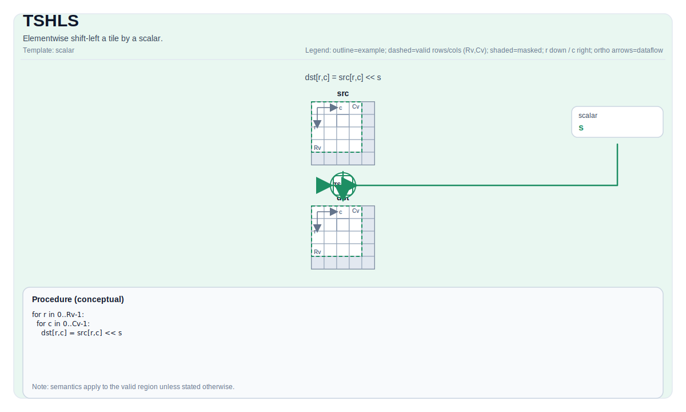

# TSHLS

## 指令示意图



## 简介

Tile 按标量逐元素左移。

## 数学语义

对每个元素 `(i, j)` 在有效区域内：

$$ \mathrm{dst}_{i,j} = \mathrm{src}_{i,j} \ll \mathrm{scalar} $$

## 汇编语法

PTO-AS 形式：参见 [PTO-AS 规范](../../../../assembly/PTO-AS_zh.md)。

同步形式：

```text
%dst = tshls %src, %scalar : !pto.tile<...>, i32
```

### AS Level 1（SSA）

```text
%dst = pto.tshls %src, %scalar : (!pto.tile<...>, dtype) -> !pto.tile<...>
```

### AS Level 2（DPS）

```text
pto.tshls ins(%src, %scalar : !pto.tile_buf<...>, dtype) outs(%dst : !pto.tile_buf<...>)
```

## C++ 内建接口

声明于 `include/pto/common/pto_instr.hpp`：

```cpp
template <typename TileDataDst, typename TileDataSrc, typename... WaitEvents>
PTO_INST RecordEvent TSHLS(TileDataDst &dst, TileDataSrc &src, typename TileDataDst::DType scalar, WaitEvents &... events);
```

## 约束

- **实现检查 (A2A3)**:
    - 支持的元素类型为 `int32_t`、`int`、`int16_t`、`uint32_t`、`unsigned int` 和 `uint16_t`。
    - `dst` 和 `src` 必须使用相同的元素类型。
    - `dst` 和 `src` 必须是向量 Tile。
    - 运行时：`src.GetValidRow() == dst.GetValidRow()` 且 `src.GetValidCol() == dst.GetValidCol()`。
    - 标量仅支持零和正值。
- **实现检查 (A5)**:
    - 支持的元素类型为 `int32_t`、`int16_t`、`int8_t`、`uint32_t`、`uint16_t` 和 `uint8_t`。
    - `dst` 和 `src` 必须使用相同的元素类型。
    - `dst` 和 `src` 必须是向量 Tile。
    - 两个 Tile 的静态有效边界都必须满足 `ValidRow <= Rows` 且 `ValidCol <= Cols`。
    - 运行时：`src.GetValidRow() == dst.GetValidRow()` 且 `src.GetValidCol() == dst.GetValidCol()`。
    - 标量仅支持零和正值。
- **有效区域**:
    - 该操作使用 `dst.GetValidRow()` / `dst.GetValidCol()` 作为迭代域。

## 示例

```cpp
#include <pto/pto-inst.hpp>

using namespace pto;

void example() {
  using TileDst = Tile<TileType::Vec, uint16_t, 16, 16>;
  using TileSrc = Tile<TileType::Vec, uint16_t, 16, 16>;
  TileDst dst;
  TileSrc src;
  TSHLS(dst, src, 0x2);
}
```

## 汇编示例（ASM）

### 自动模式

```text
# 自动模式：由编译器/运行时负责资源放置与调度。
%dst = pto.tshls %src, %scalar : (!pto.tile<...>, dtype) -> !pto.tile<...>
```

### 手动模式

```text
# 手动模式：先显式绑定资源，再发射指令。
# 可选（当该指令包含 tile 操作数时）：
# pto.tassign %arg0, @tile(0x1000)
# pto.tassign %arg1, @tile(0x2000)
%dst = pto.tshls %src, %scalar : (!pto.tile<...>, dtype) -> !pto.tile<...>
```

### PTO 汇编形式

```text
%dst = tshls %src, %scalar : !pto.tile<...>, i32
# AS Level 2 (DPS)
pto.tshls ins(%src, %scalar : !pto.tile_buf<...>, dtype) outs(%dst : !pto.tile_buf<...>)
```
