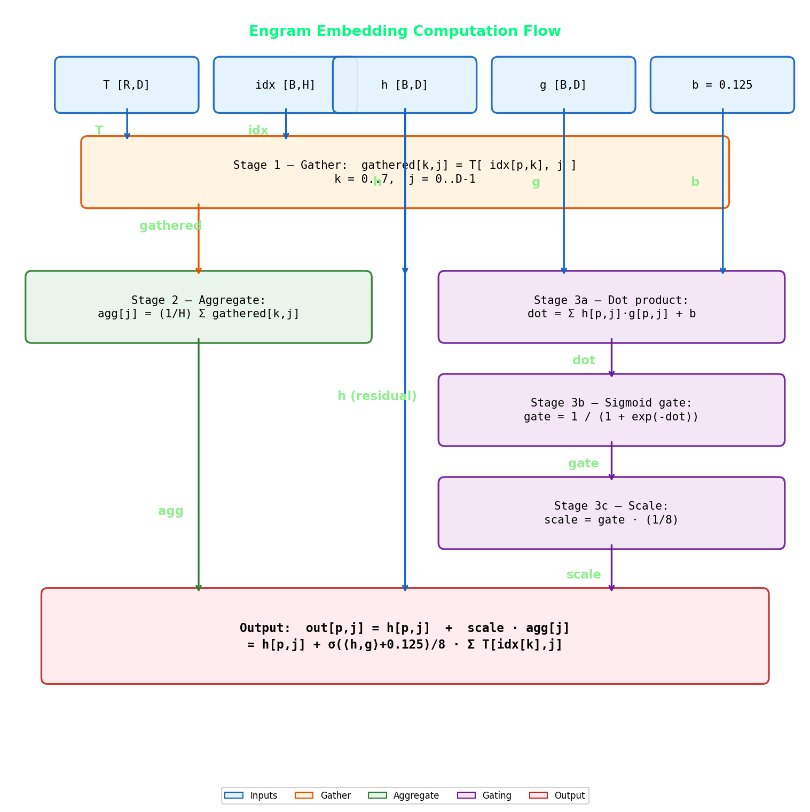
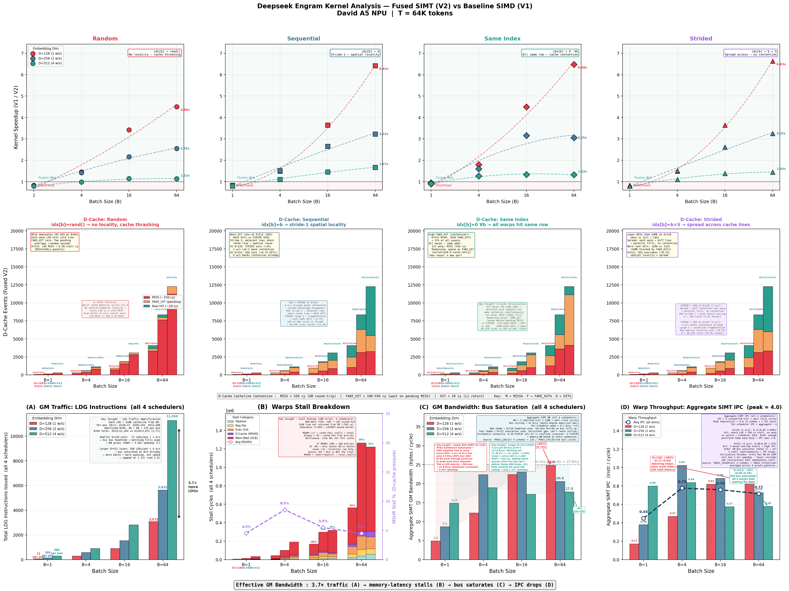

# DeepSeek Engram Performance Exploration on A5 NPU : Fused GM-SIMT Kernel

## 1. Overview

The DeepSeek Engram layer is an $O(1)$ memory lookup for N-gram context: hash a token's hidden state into $H = 8$ head indices, gather $H$ rows from a shared embedding table, column-wise mean, then sigmoid-gated residual add — **Lookup → Aggregate → Gating**. This is a GM-bandwidth-bound micro-kernel: each position moves $(H + 2) \times D \times 4$ bytes but executes very few FLOPs, placing it far below the roofline crossover. The SIMD baseline serializes $H$ DMA transfers through MTE2 with per-head pipeline barriers and routes every value through UB — making MTE2 busy cycles the dominant cost. This work fuses all three stages into a single SIMT kernel using a **Register-Forwarding Direct-GM** dataflow: data flows from GM through the D-cache directly into per-thread registers, bypassing MTE2 and UB entirely (UB is used only for cross-warp dot-product scratch).

### Quick Reference

#### Performance Tuning

| Knob | Effect | Recommendation |
|:-----|:-------|:---------------|
| Batch size $B$ | Amortizes SIMT launch overhead; enables D-cache reuse | $B \geq 4$ for speedup > 1.0×; $B \geq 16$ for significant gains |
| Embedding dim $D$ | Controls working set vs D-cache capacity | $D \leq 256$ gives best SIMT speedup (working set fits in D-cache) |
| `LAUNCH_BOUND` | Trades GPR count for warp parallelism | LB(1024) for D≤256; LB(512) for D≥512 B≥16 (64 GPRs, independent head loads) |
| Access pattern | Affects D-cache HIT rate | SEQ gives best locality; RAND worst. Difference is modest |

#### When to Use SIMT Fusion vs Baseline SIMD

| Scenario | Recommendation | Reason |
|:---------|:---------------|:-------|
| $B = 1$ | SIMD baseline | SIMT launch overhead exceeds DMA cost |
| $B \geq 4$, $D \leq 256$ | **SIMT fused** | 1.4–4.5× speedup from MTE2 elimination + D-cache reuse |
| $B \geq 4$, $D = 512$ | SIMT fused (marginal) | 1.0–1.1× speedup; GM bandwidth bottleneck for both (`but SIMT frees UB and indicates hybrid DMA-SIMT or SIMD-SIMT decoupled configurations can achieve more performance benefits`) |

#### SIMT Mapping Selection (compile-time selection via `FusedEngramImpl<D, B>`)

| Path | Config Range | `LAUNCH_BOUND` | GPRs | kColWarps | Key Property |
|:-----|:-------------|:---:|:---:|:---:|:---|
| B=1 | All D, B=1 | 1024 | 32 | D/32 | Full-column, each warp owns 32 cols |
| D≤256, B>1 | D∈{128,256}, B>1 | 1024 | 32 | D/(32×kCC) | ColChunks batched; kColWarps=1 at B=64 (zero barriers) |
| D≥512, B≥16 | D∈{512,1024}, B≥16 | 512 | 64 | D/256 | Independent per-head loads, 8 concurrent table reads |

#### ColChunks Configuration (compile-time selection)

| $D$ | $B$ | kColWarpsBase | kColChunks | kColWarps | kTotalWarps | Barriers |
|:---:|:---:|:---:|:---:|:---:|:---:|:---:|
| 128 | 1 | 4 | — | 4 | 4 | 1 |
| 128 | 4 | 4 | 1 | 4 | 16 | 1 |
| 128 | 16 | 4 | 2 | 2 | 32 | 1 |
| 128 | 64 | 4 | 4 | 1 | 64 | 0 |
| 256 | 4 | 8 | 1 | 8 | 32 | 1 |
| 256 | 16 | 8 | 4 | 2 | 32 | 1 |
| 256 | 64 | 8 | 8 | 1 | 64 | 0 |
| 512 | 16 | 16 | 8 | 2 | 32 | 1 |
| 512 | 64 | 16 | 8 | 2 | 128 | 1 per stride-loop iteration |

### SIMT Architectural Exploration Demo

Beyond kernel fusion, this demo serves as a **SIMT architectural exploration** of the A5 memory hierarchy under a real inference workload. Through CA-Model cycle-accurate simulation across 48 configurations ($3D \times 4B \times 4$ patterns), we systematically characterize the following microarchitectural phenomena:

| SIMT Perf Exploration | KeyInsight |
|:--------|:----------------|
| **Access pattern locality** | How access patterns (RAND vs SEQ vs SAME vs STRIDE) determine D-cache HIT/MISS/FAKE_HIT ratios and their impact on kernel throughput |
| **Cacheline thrashing** | D=512 working set ($12{,}288$ CL) exceeds D-cache capacity ($1{,}024$ lines) → near-zero HITs → speedup collapses from 4.5× to 1.1× --> exhibits D-cache Thrashing |
| **Cacheline reuse** | Cross-position temporal reuse: positions sharing table rows (SAME) or accessing nearby rows (SEQ) benefit from warm cachelines left by earlier warps --> exhibits D-cache reuse |
| **D-cache pressure** | Per-position cacheline demand scales as $(H + 2) \times D/32$ CL — at D=512, a single position touches 160 CL (15.6% of D-cache) |
| **D-cache contention** | Multiple warps issuing concurrent LDGs to different table rows compete for the same 1,024-line D-cache, causing eviction storms under RAND patterns |
| **D-cache serialization** | FAKE_HIT events: when multiple warps access the same cacheline while a MISS is in-flight, they serialize behind the pending fill (~100–550 cy) |
| **Memory latency** | Cold MISS costs ~550 cycles (GM round-trip). This dominates as 72–88% scoreboard stalls across all configs — the kernel is memory-latency-bound |
| **Warp effective BW vs warps/scheduler** | D=128 B=1: 1 warp/scheduler → BW = 4.89 B/cy (stall-dominated). D=128 B=64: 8 warps/scheduler → BW = 24.82 B/cy (bus-saturated). More warps hide latency until the GM bus ceiling is hit |
| **GM effective IPC** | Aggregate IPC across 4 schedulers: measures how effectively warps overlap memory stalls. D=128 IPC rises +395% with batch (latency hiding wins). D=512 IPC falls −28% (bus already saturated — more warps can't help) |
| **SIMD vs SIMT access pattern sensitivity** | SIMD: pattern-independent (DMA cost is fixed per row). SIMT: pattern-dependent (D-cache HIT rate varies 0.09%–55.5% across patterns at D=512, B=64) |

### Objectives

- Eliminate the MTE2 DMA bottleneck by replacing UB-staged tile operations with D-cache-backed register-resident execution
- Scale kernel performance with batch size $B$ via multi-position warp mapping and D-cache temporal reuse across positions
- Characterize D-cache locality, thrashing, reuse, contention, and serialization across 4 access patterns and analyze CA-Model cycle-accurate simulator traces
- Quantify the warp effective bandwidth vs warps-per-scheduler interaction and identify the GM bus ceiling (~25 B/cy)
- Measure GM effective IPC to expose the memory-latency wall: the Utilization Paradox where 98% SIMT utilization yields only 1.1× speedup at D=512
- Demonstrate that SIMD baseline is access-pattern-blind while SIMT performance is pattern-sensitive — making access patterns a optimization variable

---

## 2. Mathematical Formulation

### Inputs

| Symbol | Shape | Description |
|--------|-------|-------------|
| $T$ | $(R, D)$ | Embedding table — $R$ rows, $D$-dimensional float vectors |
| $\text{idx}$ | $(B \times H,)$ | Index vector — $H = 8$ head indices per position, $B$ positions |
| $h$ | $(B, D)$ | Hidden states — current token embeddings |
| $g$ | $(B, D)$ | Gate weights — learned gating vectors |
| $b$ | scalar | Gate bias — constant $0.125$ |

### Stage 1 — Multi-Head Gather (per position $p$)

$$\text{gathered}[p, k, j] = T[\text{idx}[p, k],\; j] \quad \forall\; k \in [0, H),\; j \in [0, D)$$

### Stage 2 — Column-wise Aggregation

$$\text{agg}[p, j] = \frac{1}{H} \sum_{k=0}^{H-1} \text{gathered}[p, k, j]$$

### Stage 3 — Context Gating (Sigmoid Linear Unit)

$$\text{dot}_p = \sum_{j=0}^{D-1} h[p, j] \cdot g[p, j] + b$$

$$\text{output}[p, j] = h[p, j] + \sigma(\text{dot}_p) \cdot \text{agg}[p, j]$$

### Combined Single-Pass Expression

$$\boxed{\text{output}[p, j] = h[p, j] + \frac{\sigma\!\bigl(\langle h_p, g_p \rangle + 0.125\bigr)}{8}\sum_{k=0}^{7} T[\text{idx}[p, k], j]}$$

### Engram Dataflow

<p align="center"></p>

---

## 3. Test Platform

### David A5 (Ascend910) SIMT Resources

| Resource | Specification |
|----------|--------------|
| Unified Buffer (UB) per Core | 256 KB on-chip SRAM |
| D-Cache per Core | 128 KB (1024 lines × 128 B) |
| Warp Schedulers per Core | 4 (round-robin) |
| Max Warps at `LAUNCH_BOUND(1024)` | 32 |
| Max Warps at `LAUNCH_BOUND(512)` | 16 |
| GPRs per Thread at LB(1024) | 32 |
| GPRs per Thread at LB(512) | 64 |
| Warp Width | 32 threads (lanes) |
| MSHR Entries | ~64 per D-cache |
| Cold MISS Latency | ~550 cycles (GM round-trip via HBM) |
| D-cache HIT Latency | ~19 cycles |
| Cacheline Size | 128 bytes (= 32 floats) |

### Thread-to-Column Mapping

Each SIMT thread owns exactly one column $j$ of the embedding dimension for the entire kernel lifetime:

```
tx  = lane_id    ∈ [0, 31]    — column within warp
ty  = warp_id    ∈ [0, kWarps - 1]
col = ty × 32 + tx            — global column index ∈ [0, D)
```

| $D$ | kWarps (B=1) | Total Threads (B=1) | Warps / Scheduler |
|:---:|:------:|:-------------:|:-----------------:|
| 128 | 4 | 128 | 1 |
| 256 | 8 | 256 | 2 |
| 512 | 16 | 512 | 4 |

---

## 4. Performance Analysis Configuration

### Test Matrix

| Parameter | Values |
|-----------|--------|
| Embedding dimension ($D$) | 128, 256, 512 |
| Batch size ($B$) | 1, 4, 16, 64 |
| Table size ($R$) | 65,536 rows (64K) |
| Access patterns | RAND, SEQ, SAME, STRIDE |
| Simulator | A5 CA-Model |

### Access Pattern Definitions

| Pattern | Index Assignment | D-Cache Behavior |
|---------|-----------------|-----------------|
| RAND | `idx[h] = rand() % R` | No locality — cold MISS dominated |
| SEQ | `idx[h] = h` | Stride-1 — spatial locality, best HIT rate |
| SAME | `idx[h] = const ∀ h` | All heads same row — maximum FAKE_HIT |
| STRIDE | `idx[h] = h × (R/H)` | Spread access — distributed cache pressure |

### Tensor Sizing

| Config | Table $R \times D$ | Per-Position GM Load |
|--------|:---:|:---:|
| D=128 | 65536 × 128 | $(8 + 2) \times 128 \times 4 = 5{,}120$ B |
| D=256 | 65536 × 256 | $(8 + 2) \times 256 \times 4 = 10{,}240$ B |
| D=512 | 65536 × 512 | $(8 + 2) \times 512 \times 4 = 20{,}480$ B |

### Trace Log Files

| # | File | Content |
|:--|:---|:---|
| 1 | `core0_summary_log` | Kernel wall-clock `busy_ticks` (baseline and fused) |
| 2 | `ts{0-3}_log.dump` | Per-scheduler instruction issues + CheckBitMask stall vectors |
| 3 | `dc.dump` | D-cache tag results: MISS / FAKE_HIT / HIT per access |
| 4 | `ub.dump` | Unified Buffer grant statistics per operation class |

---

## 5. Baseline SIMD Implementation

The baseline uses PTO SIMD tile operators with the MTE2 DMA engine for data movement, processing positions one at a time:

```
for pos = 0 to B-1:
    TLOAD(hiddenF, hidGM)         ‖ MTE2 DMA: GM → UB
    TLOAD(gateWF,  gwGM)          ‖ MTE2 DMA: GM → UB
    TLOAD(idxTile, idxGM)         ‖ MTE2 DMA: GM → UB
    pipe_barrier(PIPE_MTE2)

    for h = 0 to 7:
        TLOAD(headTile[h], embGM[idx[h]]) ‖ 8 serial DMA transfers
    pipe_barrier(PIPE_MTE2)

    TCOLSUM(aggF, lookupF2D)      ‖ Column reduction in UB
    TMULS(aggF, aggF, 1/8)        ‖ Scale to mean

    TMUL(tmpF, hiddenF, gateWF)   ‖ h × g element-wise
    TROWSUM(gsF, tmpF, tmpF)      ‖ Dot product → scalar
    TADDS(gsF, gsF, 0.125)        ‖ + bias
    TMULS(gsF, gsF, -1)           ‖ Negate
    TEXP(gsF, gsF)                ‖ exp(-x)
    TADDS(gsF, gsF, 1)            ‖ 1 + exp(-x)
    TDIVS(gsF, 1, gsF)            ‖ 1 / (1 + exp(-x)) = σ
    TROWEXPANDMUL(tmpF, aggF, gs) ‖ Gate × agg
    TADD(tmpF, hiddenF, tmpF)     ‖ + residual
    TSTORE(outGM, tmpF)           ‖ MTE3 DMA: UB → GM
```

---

## 6. Fused SIMT Implementation

### 6.1 Kernel Architecture

The fused kernel has three SIMT variants, selected at compile time by `FusedEngramImpl<D, B>`:

```
FusedEngramImpl<D, B>
    │
    ├─ if D ≥ 512 && B ≥ 16  ── simt_engram_v2_lb512<D, B>     LB(512)  64 GPRs
    │
    ├─ if B == 1             ── simt_engram_v2<D, 1>           LB(1024) 32 GPRs
    │
    └─ else (D < 512, B > 1) ── simt_engram_v2<D, B>           LB(1024) 32 GPRs
```

| Path | Config Range | `LAUNCH_BOUND` | GPRs | kColWarps | Key Property |
|:-----|:-------------|:---:|:---:|:---:|:---|
| B=1 | All D, B=1 | 1024 | 32 | D/32 | Full-column, each warp owns 32 cols |
| D≤256, B>1 | D∈{128,256}, B>1 | 1024 | 32 | D/(32×kCC) | ColChunks batched; kColWarps=1 at B=64 (zero barriers) |
| D≥512, B≥16 | D∈{512,1024}, B≥16 | 512 | 64 | D/256 | Independent per-head loads, 8 concurrent table reads |

### 6.2 Multi-Position Warp Mapping (B > 1)

The core structural optimization of this kernel is multi-position concurrent processing. Instead of processing positions serially like the baseline, all $B$ positions are mapped to warps simultaneously:

```
kColWarpsBase = D / 32           (e.g., D=256 → 8)
kColChunks    = ColChunksImpl<kColWarpsBase, B>::value
                                  Compile-time: smallest CC such that
                                  (kColWarpsBase / CC) divides evenly AND
                                  (kColWarpsBase / CC) × B ≤ 32
kColWarps     = kColWarpsBase / kColChunks     (column partitions per position)
kTotalWarps   = kColWarps × B                  (total logical warps)
kLaunchWarps  = min(kTotalWarps, 32)           (physical warps launched)
```

At large batch (B=64 for D≤256), ColChunksImpl reaches kColChunks = kColWarpsBase → **kColWarps = 1** → each warp owns the full column range for its position → **zero cross-warp barriers**. At smaller batches (B=4, B=16), kColWarps > 1 and cross-warp dot-product reduction via UB scratch + `__sync_workitems()` is required.

Position-to-warp assignment:

```
for (warpId = ty; warpId < kTotalWarps; warpId += kLaunchWarps):
    posId   = warpId / kColWarps       ← which position this warp processes
    colWarp = warpId % kColWarps       ← which column partition (0 when kColWarps=1)
```

When `kTotalWarps > 32` (e.g., D=128, B=64: $1 \times 64 = 64$ logical warps), the stride loop lets 32 physical warps process 64 positions in 2 iterations.

### 6.3 ColChunks Compile-Time Configuration Setting

The `ColChunksImpl<CWB, B>` metafunction finds the optimal column-chunking factor at compile time:

| $D$ | $B$ | kColWarpsBase | kColChunks | kColWarps | kTotalWarps | Barriers |
|:---:|:---:|:---:|:---:|:---:|:---:|:---:|
| 128 | 1 | 4 | — | 4 | 4 | 1 |
| 128 | 4 | 4 | 1 | 4 | 16 | 1 |
| 128 | 16 | 4 | 2 | 2 | 32 | 1 |
| 128 | 64 | 4 | 4 | 1 | 64 | 0 |
| 256 | 4 | 8 | 1 | 8 | 32 | 1 |
| 256 | 16 | 8 | 4 | 2 | 32 | 1 |
| 256 | 64 | 8 | 8 | 1 | 64 | 0 |
| 512 | 16 | 16 | 8 | 2 | 32 | 1 |
| 512 | 64 | 16 | 8 | 2 | 128 | 1 per stride-loop iteration |

For D≤256 with B=64: kColChunks equals kColWarpsBase, collapsing all column warps into a single warp per position. Each thread processes `kColChunks` columns via an unrolled inner loop, accumulating `dot_partial` across all chunks. The `redux_add` then reduces the full D-wide dot product within a single warp — no UB scratch or barrier needed. At smaller batches (B=4, B=16), ColChunksImpl selects a smaller kColChunks to keep kTotalWarps ≤ 32, leaving kColWarps > 1 and requiring cross-warp reduction.

### 6.4 B=1 Kernel Structure

```cpp
__simt_vf__ LAUNCH_BOUND(1024)
void simt_engram_v2<D, 1>(...)
{
    const uint32_t col = ty * 32 + tx;
    if (ty >= D/32) return;

    // Phase A: Load hidden, gate_weight (coalesced LDG → D-cache → GPR)
    float h_val = gmHidden[col];
    float g_val = gmGateW[col];

    // Phase B: Load indices (warp-uniform, single cacheline)
    int32_t idx[8];
    for (h = 0..7) idx[h] = gmIndices[h];

    // Phase C: Warp-partitioned dot product
    float warp_dot = redux_add(h_val * g_val);   // hardware 32-lane sum
    scrBuf[ty] = warp_dot;                       // partial sum → UB
    __sync_workitems();                          // ONLY cross-warp barrier

    // Phase D: Reconstruct full dot, apply gating
    float dot = 0.125;
    for (w = 0..kWarps-1) dot += scrBuf[w];
    float gate = 1 / (1 + expf(-dot));

    // Phase E: Streamed embedding accumulation
    float agg = gmTable[idx[0] * D + col];
    for (h = 1..7) agg += gmTable[idx[h] * D + col];

    gmOutput[col] = h_val + (gate / 8) * agg;
}
```

### 6.5 B>1 Kernel Structure (kColWarps=1 path, e.g., D≤256 B=64)

```cpp
__simt_vf__ LAUNCH_BOUND(1024)
void simt_engram_v2<D, B>(...)    // D ≤ 256, B > 1
{
    for (warpId = ty; warpId < kColWarps * B; warpId += kLaunchWarps) {
        posId = warpId;           // kColWarps=1, so warpId == posId

        // Phase A: Multi-chunk dot product (zero barriers)
        float dot_partial = 0;
        float h_reg[kColChunks];  // cached for Phase C
        for (c = 0..kColChunks-1) {
            col = c * 32 + tx;
            h_reg[c] = gmHidden[posId * D + col];
            dot_partial += h_reg[c] * gmGateW[posId * D + col];
        }

        // Single-warp redux — NO barrier (kColWarps=1)
        float dot = redux_add(dot_partial) + 0.125;
        float gate = 1 / (1 + expf(-dot));

        // Phase B: Embedding lookup + fused output
        int32_t idx[8];
        for (h = 0..7) idx[h] = gmIndices[posId * 8 + h];

        for (c = 0..kColChunks-1) {
            col = c * 32 + tx;
            float agg = gmTable[idx[0] * D + col];
            for (h = 1..7) agg += gmTable[idx[h] * D + col];
            gmOutput[posId * D + col] = h_reg[c] + (gate / 8) * agg;
        }
    }    // stride loop for kTotalWarps > 32
}
```

### 6.6 LB(512) Variant (D≥512, B≥16)

At D≥512 with B≥16, this variant uses `LAUNCH_BOUND(512)` for 64 GPRs per thread. Key architectural differences:

1. **Independent per-head loads**: Instead of serial `agg += gmTable[...]` (which creates a dependency chain blocking the next load), all 8 table rows are loaded into independent temporaries `t0..t7` then tree-summed as `(t0+t1) + (t2+t3) + (t4+t5) + (t6+t7)`. This breaks the serial dependency chain and exposes 8 concurrent outstanding LDGs per column.

2. **kColWarps=D/256** (2 at D=512, 4 at D=1024): Preserves active warps for latency hiding while keeping the D-cache working set manageable.

3. **Indices loaded early**: `idx[H]` is loaded before the dot-product phase to pipeline GM latency with subsequent computation.

---

## 7. Core SIMT Optimizations

### 7.1 Register-Forwarding Direct-GM Dataflow

All **input data** (table, hidden, gate_weight, indices) and **output data** bypass the UB entirely. Values flow from GM through the D-cache directly into per-thread GPRs:

```
┌──────┐                  ┌──────────┐
│  GM  │──── D-cache ────>│ Register │──> h_val × g_val (partial dot)
│      │     (LDG)        │   File   │──> Σ table rows (agg)
└──────┘                  │  (GPRs)  │──> fused output = h + σ(dot) × agg/8
                          └─────┬────┘
                                ↓ warp_dot only (B=1 or kColWarps>1)
                          ┌────────────┐
                          │ UB scratch │ ← kColWarps partial sums
                          └────────────┘
                     __sync_workitems()
```

**UB is still used for cross-warp dot-product reduction** when `kColWarps > 1` (B=1 path: always; D≥512 B≥16 LB512: kColWarps=D/256). Each warp writes its `warp_dot` partial sum to `scrBuf[ty]`, issues `__sync_workitems()`, then reads back kColWarps entries. For D≤256 B>1 (`kColWarps = 1`), `redux_add` completes the entire dot product within a single warp — **zero UB usage, zero barriers**.

The remaining SIMT UB traffic visible in `ub.dump` (SIMT_R, BHU_W, BHU_R) is automatic D-cache hardware plumbing — invisible to the application I/O and non-blocking.

**UB Application-initiated I/O Operations (from ub.dump `[UB_GRANT_STATS]`, B=1)**:

| $D$ | SIMD Baseline Total | SIMT Writer (STG only) | Reduction |
|:---:|:---:|:---:|:---:|
| 128 | 129 | 8 | 94% |
| 256 | 239 | 16 | 93% |
| 512 | 459 | 32 | 93% |

**MTE2 busy cycles (B=64, RAND)**:
- Baseline: 106,261 cycles
- Fused: 5 cycles (hardware setup only)
- Reduction: **~0%**

### 7.2 Multi-Position Warp Mapping & Position Stride Loop

For $B > 1$, warp ID maps directly to position ID via `posId = warpId / kColWarps`. When `kTotalWarps > kLaunchWarps` (e.g., D=128, B=64 → 64 logical warps, 32 physical), the stride loop `for (warpId = ty; ...; warpId += kLaunchWarps)` distributes work across iterations:


This amortizes the SIMT launch overhead (~1,100 cycles) across all $B$ positions. At B=1 the overhead is 1,100 cy/position; at B=64 it amortizes to ~17 cy/position.

### 7.3 Zero-Barrier Design for D≤256 (ColChunks Remapping)

When ColChunks = kColWarpsBase (true for D≤256 at B=64), each warp covers the entire embedding dimension. The dot product `redux_add(dot_partial)` completes within a single warp — **no `__sync_workitems()` barrier needed**:

| Approach | Barriers | Overhead |
|:---------|:---:|:---|
| B=1 cross-warp dot (kWarps = D/32) | 1 | ~200 cy latency + sync jitter |
| D≤256 B=64 ColChunks (kColWarps=1) | **0** | Zero barrier — parallel |
| D≥512 B≥16 LB512 (kColWarps=2) | 1 per stride iteration | Required for cross-warp dot sum |

### 7.4 Warp-Partitioned Cross-Warp Dot Product

When kColWarps > 1 (B=1 path or D≥512), the $D$-wide dot product spans multiple warps. Each warp computes only its 32-element partition:

$$\text{warp\_dot}_w = \texttt{redux\_add}\!\left(\sum_{c \in \text{chunk}_w} h[\text{col}_c] \cdot g[\text{col}_c]\right)$$

Partial sums are shared via UB scratch + one `__sync_workitems()`:

$$\text{dot} = 0.125 + \sum_{w=0}^{\text{kColWarps}-1} \texttt{scrBuf}[w]$$

Without partitioning, every warp would redundantly load ALL $D$ values of $h$ and $g$, generating massive D-cache FAKE_HITs:

| $D$ | kWarps | Naive Total Loads (h+g) | Partitioned Loads | Savings |
|:---:|:------:|:---:|:---:|:---:|
| 128 | 4 | 32 | 8 | 75% |
| 256 | 8 | 128 | 16 | 87.5% |
| 512 | 16 | 512 | 32 | 93.75% |

Naive: each warp loads all $D/32$ cachelines for both $h$ and $g$ = $\text{kWarps} \times 2 \times D/32$. Partitioned: each warp loads only its 32-element slice = $\text{kWarps} \times 2$.

### 7.5 SIMT In-Register Caching

In the B>1 path, `h_reg[kColChunks]` is loaded during the dot-product phase and kept live in registers for the output phase. This eliminates a second set of D-cache reads for hidden:

```cpp
// Phase A: load + dot
float h_reg[kColChunks];
for (c = 0..kColChunks-1) {
    h_reg[c] = gmHidden[posId * D + col];     // First load → D-cache MISS
    dot_partial += h_reg[c] * gmGateW[...];
}

// Phase C: reuse from register (zero D-cache cost)
gmOutput[...] = h_reg[c] + (gate * kInvH) * agg;
```

At D=256: saves 8 LDG instructions per position ($8 \times 128\text{B} = 1{,}024\text{B}$ per position).

### 7.6 Streamed Embedding Accumulation

Instead of materializing all $H = 8$ gathered rows in a register array (consuming 8 GPRs per column), the kernel streams them into a single accumulator:


At `LAUNCH_BOUND(1024)` with 32 GPRs, the kernel uses ~25 base GPRs. An `emb[8]` array pushes to 33 and triggers register spills, increasing SIMT_busy by 30%+ at D=256.

The LB(512) variant uses the opposite strategy — 8 independent loads `t0..t7` — because 64 GPRs provide ample headroom and the independent loads break the serial dependency chain for better instruction-level parallelism.

### 7.7 Independent Head-Load Pattern (512 Shape)

In the LB(512) variant, all 8 table row loads per column are issued independently:

```cpp
float t0 = gmTable[idx[0] * D + col];
float t1 = gmTable[idx[1] * D + col];  // no dependency on t0
...
float t7 = gmTable[idx[7] * D + col];  // no dependency on t0..t6
float agg = (t0 + t1) + (t2 + t3) + (t4 + t5) + (t6 + t7);
```

With the serial `agg += ...` approach, each load depends on the previous addition completing — limiting outstanding to 1 per column. With independent loads, the D-cache can have $\leq 8$ concurrent requests per column per warp, significantly improving memory-level parallelism.

### 7.8 Bias Merging

The gate bias $b = 0.125$ is used as the dot-product accumulator's initial value:

```cpp
dot = kGateBiasF;                           // 0.125 as initial value
for (w = 0..kColWarps-1) dot += scrBuf[w];   // kColWarps FADDs total
// vs naive: dot = 0; for (...) dot += ...; dot += kGateBiasF;  // kColWarps+1
```

Saves 1 FADD per thread.

---

## 8. Engram Kernel Performance Analysis — Fused SIMT vs SIMD (CA Model)



The figure presents 12 subplots organized as:
- **Row 1** (4 subplots): Kernel speedup per access pattern
- **Row 2** (4 subplots): D-cache event breakdown per access pattern
- **Row 3** (4 subplots): Root cause analysis — GM Traffic (A), Stall Breakdown (B), GM Bandwidth (C), Warp Throughput IPC (D)

All numerical values are extracted from CA-Model cycle-accurate simulator trace logs.

### Variable Extraction Reference

| Variable | Source File | Extraction |
|:---------|:-----------|:-----------|
| TICKS | `core0_summary_log` | `busy_ticks` field (one per kernel run) |
| TRACE_ISSUED | `ts{0-3}_log.dump` | `grep -c ') issue'` per scheduler, sum all 4 |
| TRACE_LDG | `ts{0-3}_log.dump` | `grep -c 'SIMT_LDG.*issue'` per scheduler, sum all 4 |
| TRACE_CYCLES | `ts0_log.dump` | Last − first `CheckBitMask` timestamp (shared clock across all 4 schedulers) |
| DC events | `dc.dump` | `grep -c "tagRst:MISS\|FAKE_HIT\|HIT"` |
| CBM_STALLS | `ts{0-3}_log.dump` | Parse 14-bit CheckBitMask per cycle, count each bit category, sum all 4 schedulers |

---

### 8.1 Kernel Speedup

#### RAND Pattern Speedup

| $D$ | B=1 | B=4 | B=16 | B=64 |
|:---:|:---:|:---:|:----:|:----:|
| 128 | 0.80× | 1.45× | 3.42× | **4.50×** |
| 256 | 0.83× | 1.42× | 2.16× | **2.55×** |
| 512 | 0.79× | 0.98× | 1.14× | **1.13×** |

**B=1 is always slower** (0.79–0.83×): SIMT launch overhead (~1,100 cycles for warp configuration + barrier + D-cache cold startup) exceeds the baseline's serial DMA cost at single-position scale. **Crossover** at B ≈ 3–4 for D=128.

**D=128 achieves 4.50× at B=64**: Per-position cost drops from 4,576 cy/pos (B=1) to 380 cy/pos (B=64) — 12.0× amortization. The D-cache working set at D=128 fits well: 4,096 cacheline requests across 64 positions yield 10.5% HIT rate from cross-position reuse.

**D=512 plateaus at 1.13×**: Working set of 12,288 cacheline requests far exceeds the 1,024-line D-cache capacity. Near-zero HIT rate (0.09%) means both baseline and fused variants are equally GM-bandwidth-bound.

---

### 8.2 D-Cache Event Breakdown

Stacked bars per pattern showing MISS, FAKE_HIT, and HIT counts for the fused kernel.

| Event | Meaning | Latency |
|:------|:--------|:--------|
| **MISS** | Cacheline not present → triggers GM fetch | ~550 cycles |
| **FAKE_HIT** | Pending MISS in-flight → piggybacks, no new GM request | ~100–550 cycles |
| **HIT** | Cacheline resident — valid data | ~19 cycles |

#### D-Cache Events at B=64 (from `dc.dump`)

| Pattern | $D$ | MISS | FAKE_HIT | HIT | Total | MISS % |
|:--------|:---:|:----:|:--------:|:---:|:-----:|:------:|
| RAND | 128 | 3,320 | 347 | 429 | 4,096 | 81% |
| RAND | 256 | 7,632 | 384 | 336 | 8,352 | 91% |
| RAND | 512 | 11,248 | 1,029 | 11 | 12,288 | 92% |
| SEQ | 512 | 3,259 | 2,204 | 6,825 | 12,288 | 27% |
| SAME | 512 | 4,113 | 7,026 | 1,149 | 12,288 | 33% |
| STRIDE | 512 | 3,330 | 2,677 | 6,281 | 12,288 | 27% |

**RAND**: MISS dominates at 81–92%. Random indices produce no spatial or temporal locality.

**SEQ**: Best HIT rate — 55.5% at D=512, B=64. Sequential indices access consecutive rows; warp scheduling depth creates temporal overlap where earlier loads complete before later warps access nearby cachelines.

**SAME**: Highest FAKE_HIT — 57.2% at D=512, B=64. All 8 heads access the identical row, so the first warp's MISS triggers 7 subsequent FAKE_HITs while the cacheline fill is still in-flight.

**Cross-pattern performance impact**: SEQ fused ticks = 67,962 vs STRIDE = 78,498 at D=512, B=64 — a 13.4% advantage from better D-cache locality.

---

### 8.3 GM Traffic (LDG Instructions)

Total SIMT_LDG instructions issued across all 4 schedulers. LDG count is pattern-independent (same program path regardless of index values).

| $B$ | D=128 | D=256 | D=512 |
|:---:|:-----:|:-----:|:-----:|
| 1 | 72 | 144 | 288 |
| 4 | 288 | 576 | 896 |
| 16 | 896 | 1,536 | 2,816 |
| 64 | 3,072 | 5,632 | 11,264 |

**Per-warp LDG count**: 18 LDGs/warp at B=1 — each warp loads 10 values via LDG (1 hidden + 1 gate_weight + 8 table row elements), plus 8 additional LDGs for index loads (`gmIndices[h]` for h=0..7, warp-uniform but each generates a separate LDG instruction). UB scratch reads (`scrBuf[w]`) are NOT LDGs — they are direct UB reads. Total: $18 \times \text{kWarps}$ (72 = 18×4, 144 = 18×8, 288 = 18×16).

**D=512 issues 3.7× more LDGs than D=128** at every batch: $11{,}264 / 3{,}072 = 3.67\times$. This traffic ratio is the root cause of D=512's performance gap.

**Per-position amortization** at B=64: D=128: $3{,}072/64 = 48$ LDGs/pos (vs 72 at B=1 → 33% saved); D=512: $11{,}264/64 = 176$ (vs 288 → 39% saved). The savings come from hidden/gate_weight D-cache reuse across positions.

---

### Stall Breakdown (CheckBitMask)

The 14-bit `CheckBitMask` field in each scheduler's trace indicates stall conditions per cycle. Each bit is counted across all cycles of all 4 schedulers:

| Bit | Stall | Description |
|:---:|:---:|:---|
| 13 | RdSplit | Read-split buffer full |
| 12 | MSHR | D-cache MSHR entry exhausted — cannot accept new MISS |
| 9 | ExUnit | Execution unit resource conflict |
| 8–5 | RegFile | Register file read port conflict |
| 3 | Scoreboard | Data dependency — LDG issued but data not returned (~550 cy wait) |
| 2–0 | Pipeline | Instruction pipeline / setup stall |

Values below are averaged across 4 access patterns.

**Scoreboard dominance**: Scoreboard (memory-wait) constitutes **72–88%** of all stall cycles across every configuration. This proves the fused kernel is fundamentally memory-latency-bound.

**MSHR stalls** are only **1–5%** at B=64, confirming the D-cache has free MSHR slots. The bottleneck is not cache capacity but GM round-trip latency.

---

### 8.5 GM Bandwidth

Aggregate SIMT GM bandwidth measures how fast the engine delivers data through the D-cache return path:

$$
BW(D, B) = \frac{\text{trace-ldg}[B][D] \cdot 128B}{\text{mean}(\text{trace-cycles over 4 patterns})}
$$


| Config | LDGs | Bytes | Mean Cycles | **BW (B/cy)** |
|:-------|:---:|:---:|:---:|:---:|
| D=128, B=1 | 72 | 9,216 | 1,884 | **4.89** |
| D=128, B=4 | 288 | 36,864 | 3,005 | **12.27** |
| D=128, B=16 | 896 | 114,688 | 5,119 | **22.40** |
| D=128, B=64 | 3,072 | 393,216 | 15,844 | **24.82** |
| D=256, B=1 | 144 | 18,432 | 2,131 | **8.65** |
| D=256, B=4 | 576 | 73,728 | 3,299 | **22.35** |
| D=256, B=16 | 1,536 | 196,608 | 8,529 | **23.05** |
| D=256, B=64 | 5,632 | 720,896 | 35,022 | **20.58** |
| D=512, B=1 | 288 | 36,864 | 2,487 | **14.82** |
| D=512, B=4 | 896 | 114,688 | 6,063 | **18.92** |
| D=512, B=16 | 2,816 | 360,448 | 20,971 | **17.19** |
| D=512, B=64 | 11,264 | 1,441,792 | 80,967 | **17.81** |


The empirical peak is 24.82 B/cy at D=128, B=64 — rounded to 25. This is NOT a hardware spec; it is the maximum throughput the GM return path (HBM → NoC → D-cache fill port) sustains in the simulator model. Per-warp sustained BW is only $128 / 550 = 0.23$ B/cy; the aggregate 25 B/cy is achieved because multiple warps issue concurrent LDGs whose 550-cycle stalls overlap:


**D=128**: BW rises from 4.89 to 24.82 (+407%) as batch grows. At B=1 with 1 warp/scheduler, insufficient memory-level parallelism. At B=64, enough LDGs in-flight to saturate the bus.

**D=512**: BW peaks at B=4 (18.92) and barely changes (17–18). The 11,264 × 128B = 1.4 MB working set far exceeds D-cache capacity. Constant thrashing holds BW below the ceiling.

---

### 8.6 Warp Throughput (IPC)

Instructions Per Cycle aggregated across all 4 schedulers:

$$IPC(D, B) = \text{mean}\!\left(\frac{\text{trace-issued}[B][D]}{\text{trace-cycles}[\text{pat}][D][B]}\right)_{\text{4 patterns}}$$

| Config | TRACE_ISSUED | Mean Cycles | **Agg IPC** | Per-Sched IPC |
|:-------|:---:|:---:|:---:|:---:|
| D=128, B=1 | 316 | 1,884 | **0.170** | 0.043 |
| D=128, B=4 | 1,376 | 3,005 | **0.469** | 0.117 |
| D=128, B=16 | 4,096 | 5,119 | **0.820** | 0.205 |
| D=128, B=64 | 12,864 | 15,844 | **0.843** | 0.211 |
| D=256, B=1 | 792 | 2,131 | **0.378** | 0.094 |
| D=256, B=4 | 3,360 | 3,299 | **1.024** | 0.256 |
| D=256, B=16 | 7,328 | 8,529 | **0.882** | 0.221 |
| D=256, B=64 | 25,216 | 35,022 | **0.728** | 0.182 |
| D=512, B=1 | 1,968 | 2,487 | **0.800** | 0.200 |
| D=512, B=4 | 4,992 | 6,063 | **0.837** | 0.209 |
| D=512, B=16 | 11,904 | 20,971 | **0.573** | 0.143 |
| D=512, B=64 | 45,888 | 80,967 | **0.579** | 0.145 |

**Peak theoretical IPC = 4.0**: 4 schedulers × 1.0 max each.


**D=128 IPC rises** with batch (0.17 → 0.84, +395%): At B=1, 1 warp/scheduler stalls for 550 cycles per LDG with no other warp to switch to. At B=64, the stride loop gives the scheduler 64 positions worth of work — during 550-cycle stalls, it can issue instructions for other positions.

**D=512 IPC falls** from B=1 to B=64 (0.80 → 0.58, −28%): At B=1, 4 warps/scheduler overlap stalls effectively. At B=64, massive LDG pressure saturates the GM bus (Panel C) — ALL warps stall simultaneously waiting for data, pushing IPC down.

---

### 8.7 Key Take-Away

$$\boxed{3.7\times \text{ GM traffic (A)} \;\rightarrow\; \text{memory-latency stalls (B)} \;\rightarrow\; \text{bus saturates at 25 B/cy (C)} \;\rightarrow\; \text{IPC drops (D)}}$$

1. D=512 issues **3.7×** more LDGs than D=128 at B=64 (11,264 vs 3,072)
2. Those LDGs cause **72–88% scoreboard stalls** — warps wait 550 cycles per GM round-trip
3. The GM bus **saturates at ~25 B/cy** — physical return path cannot deliver data faster
4. All warps stall together → **IPC drops** from 0.80 to 0.58 at D=512

---

### 8.8 SIMT Architectural Exploration

#### Summary Table

| # | Phenomenon | Definition | Key Observation in Engram |
|:-:|:-----------|:-----------|:--------------------------|
| 1 | **D-Cache Locality** | Benefits from accessing nearby (spatial) or recently-used (temporal) addresses. HIT ~19 cy vs MISS ~550 cy. | SEQ at D=512 B=64: 55.5% HIT. RAND: 0.09%. SEQ ticks 26% lower than RAND. |
| 2 | **D-Cache Thrashing** | Working set exceeds cache capacity → continuous eviction of needed lines. | D=128: 40 CL/pos (3.9% of cache) → 4.50×. D=512: 160 CL/pos (15.6%) → 1.13×. Speedup cliff. |
| 3 | **D-Cache Reuse** | Cacheline loaded by one consumer remains resident for later consumers. Warp scheduling order determines survival. | SAME: 8 heads share a row → first MISS fills, 7 others get FAKE_HIT/HIT. `h_reg[]` keeps hidden in GPRs for output reuse (§7.5). |
| 4 | **D-Cache Pressure** | Ratio of unique CL touched to cache size. High pressure → eviction storms. | D=128 B=64: moderate pressure → 24.82 B/cy. D=512 B=64: 160 CL/pos eviction pressure → 17.81 B/cy despite 3.7× more LDGs. |
| 5 | **D-Cache Contention** | Multiple warps compete for the same cache, each MISS evicting another warp's data. | D=512: IPC *falls* −28% with batch (destructive eviction). D=128: IPC *rises* +395% (no contention). |
| 6 | **D-Cache Serialization** | Multiple requestors access a cacheline while a MISS is in-flight → queue behind the fill (FAKE_HIT, ~100–550 cy). | SAME at D=512 B=64: 57.2% FAKE_HITs (7,026/12,288). Saves GM BW but serialization penalty offsets reuse benefit → SAME ≈ SEQ. |
| 7 | **Memory Latency** | Time from LDG issue to data return. HIT ~19 cy, cold MISS ~550 cy (cache → NoC → HBM → return). | Scoreboard stalls = 72–88% of all stall cycles across every config. Kernel is memory-latency-bound. |
| 8 | **Warp Effective BW** | Single warp: 0.23 B/cy. Multiple warps overlap stalls → aggregate BW grows until bus ceiling. | D=128: 4.89 → 24.82 B/cy (+5×) with batch. D=512: peaks at 18.92 and flatlines (thrashing). Bus ceiling ~25 B/cy. |
| 9 | **GM Effective IPC** | Instructions/cycle across 4 schedulers (peak 4.0). Rising IPC = latency hiding works. Falling IPC = bus saturated. | D=128: +395% IPC B=1→B=64 (latency-limited → add warps helps). D=512: −28% (bandwidth-limited → more warps hurt). |

#### Observed Pattern

<details>
<summary><b>8.8.1 D-Cache Locality</b></summary>

| Metric | RAND (D=512 B=64) | SEQ (D=512 B=64) | Delta |
|:-------|:--:|:--:|:--:|
| HIT rate | 0.09% | 55.5% | +55.4pp |
| Kernel ticks | higher | 26% lower | SEQ wins |

Sequential indices access consecutive table rows that share cachelines → spatial locality. Random indices scatter across the 64K-row table → no spatial relationship.
</details>

<details>
<summary><b>8.8.2 D-Cache Thrashing</b></summary>

| $D$ | CL/position | % of D-cache (1024 lines) | CL at B=64 | Speedup |
|:---:|:-----------:|:-------------------------:|:----------:|:-------:|
| 128 | 40 | 3.9% | 2,560 | **4.50×** |
| 256 | 80 | 7.8% | 5,120 | **2.55×** |
| 512 | 160 | 15.6% | 10,240 | **1.13×** |

Per-position CL demand = $(H + 2) \times D/32$. At D=512 B=64, total demand is 10× cache capacity → near-zero HITs → speedup collapses.
</details>

<details>
<summary><b>8.8.3 D-Cache Reuse</b></summary>

| Reuse Type | Mechanism | Benefit |
|:-----------|:----------|:--------|
| Cross-head (SAME) | All 8 heads index same row → first MISS fills CL, 7 others get FAKE_HIT/HIT | Saves 7 GM requests per position |
| Cross-position (SEQ) | Adjacent positions access nearby rows → warm CL from earlier warps | Temporal overlap from warp scheduling depth |
| Intra-position (GPR) | `h_reg[kColChunks]` loaded in dot-product phase, reused in output phase (§7.5) | Zero D-cache cost for hidden re-read |
</details>

<details>
<summary><b>8.8.4 D-Cache Pressure</b></summary>

| Config | CL/position | Effective BW | Bottleneck |
|:-------|:-----------:|:------------:|:-----------|
| D=128 B=64 | 40 | 24.82 B/cy | GM bus ceiling (~25 B/cy) |
| D=512 B=64 | 160 | 17.81 B/cy | Cache eviction pressure |

D=128: moderate pressure → cache absorbs traffic → BW reaches bus ceiling. D=512: 160 CL/pos sustained eviction prevents cache from retaining data → BW capped below bus ceiling.
</details>

<details>
<summary><b>8.8.5 D-Cache Contention</b></summary>

| Config | Warps/scheduler | IPC trend with batch | Explanation |
|:-------|:---------------:|:--------------------:|:------------|
| D=128 | 1 → 8 | +395% (rises) | Working set fits → more warps = more latency hiding |
| D=512 | 4 → 4 (×8 stride) | −28% (falls) | Working set overflows → stride loop touches 8× more table rows per warp |

At D=512 B=64: 128 logical warps mapped to 16 physical (4/scheduler). The stride loop makes each warp process 8 positions, each touching 160 unique CL → massive cache pollution per warp.
</details>

<details>
<summary><b>8.8.6 D-Cache Serialization (FAKE_HIT)</b></summary>

| Pattern | D=512 B=64 Events | MISS | FAKE_HIT | HIT | FAKE_HIT % |
|:--------|:------------------:|:----:|:--------:|:---:|:----------:|
| SAME | 12,288 | 4,113 | **7,026** | 1,149 | **57.2%** |
| RAND | 12,288 | 11,248 | 1,029 | 11 | 8.4% |

SAME: all 8 heads → same row → first warp triggers MISS → 7 others queue behind (FAKE_HIT). Saves GM bandwidth but serialization penalty (~100–550 cy wait) offsets the reuse benefit → SAME ≈ SEQ performance.
</details>

<details>
<summary><b>8.8.7 Memory Latency</b></summary>

| Stall Category | Share of Total Stalls | Implication |
|:---------------|:---------------------:|:------------|
| Scoreboard (LDG wait) | **72–88%** | Warps wait ~550 cy per GM round-trip |
| MSHR | 1–5% | Cache slots available — not the bottleneck |
| Other (ExUnit, RegFile, Pipeline) | 7–27% | Minor contributors |

The kernel is not compute-bound, not cache-capacity-bound, not MSHR-limited — it is **memory-latency-bound**. Even at 98.4% SIMT utilization, ~75% of execution time is spent waiting for data.
</details>

<details>
<summary><b>8.8.8 Warp Effective BW vs Warps-per-Scheduler</b></summary>

| Config | Warps/Sched | BW (B/cy) | vs B=1 |
|:-------|:-----------:|:---------:|:------:|
| D=128 B=1 | 1 | 4.89 | — |
| D=128 B=64 | 8 | 24.82 | **+5.1×** |
| D=512 B=1 | 4 | 14.82 | — |
| D=512 B=64 | 4 | 17.81 | +1.2× |

D=128: BW scales 5× with warps (latency hiding). D=512: BW flatlines (thrashing prevents cache absorption). The ~25 B/cy ceiling is the physical throughput of GM return path (HBM → NoC → D-cache fill port).
</details>

<details>
<summary><b>8.8.9 GM Effective IPC</b></summary>

| Config | Agg IPC | Trend B=1→B=64 | Diagnosis |
|:-------|:-------:|:---------------:|:----------|
| D=128 | 0.17 → 0.84 | **+395%** | Latency-limited: more warps help |
| D=512 | 0.80 → 0.58 | **−28%** | Bandwidth-limited: more warps hurt |

Rising IPC = scheduler finds ready warps during 550-cy stalls. Falling IPC = all warps stall simultaneously waiting for data (bus saturated).
</details>

---

## 9. Key Insights

1. **MTE2 elimination is the primary speedup source**: Baseline spends most of kernel ticks in MTE2 DMA. SIMT reduces MTE2 to 5 cycles (hardware setup), converting the bottleneck from DMA-serialization to D-cache-backed register execution.

2. **Batch amortizes SIMT overhead**: B=1 is 0.8× (slower, launch overhead dominates). B=64 is 4.5× (12× per-position amortization). Crossover at B ≈ 3–4.

3. **D-cache working set determines speedup ceiling**: D=128 working set (4,096 CL at B=64) yields 10.5% HIT rate → 4.50×. D=512 working set (12,288 CL >> 1,024 capacity) yields 0.09% HITs → 1.13×.

4. **Memory-latency (scoreboard) is the main bottleneck**: 72–88% of all stall cycles across every configuration. The kernel is memory-latency-bound, not compute-bound or cache-capacity-bound.

5. **MSHR is NOT exhausted**: Only 1–5% MSHR stalls at B=64. The 64-entry MSHR has free capacity. The bottleneck is GM round-trip latency, not cache slot availability.

6. **The GM bus saturates at ~25 B/cy**: Empirical ceiling (24.82 B/cy at D=128, B=64). D=512 hits this ceiling at B=4 and cannot improve further.

7. **IPC divergence reveals the scaling wall**: D=128 IPC rises +395% with batch (more work helps). D=512 IPC falls −28% (more work hurts — bus already saturated).

8. **Access pattern has modest impact**: RAND vs SAME shows only ~11% difference at D=256, B=4. Warp scheduling hides most pattern effects.

9. **The Utilization Paradox**: D=512 achieves 98.4% SIMT utilization but only 1.13× speedup. The SIMT engine is "busy" whenever any warp issues an instruction — including `SIMT_LDG` that then stalls 550 cycles. The scheduler always finds a warp to issue (high utilization), but the issued instruction is often a memory access that contributes only latency, not useful compute.

---

## 10. Performance Tuning Knob

| Knob | Effect | Recommendation |
|:-----|:-------|:---------------|
| Batch size $B$ | Amortizes SIMT launch overhead; enables D-cache reuse | $B \geq 4$ for speedup > 1.0×; $B \geq 16$ for significant gains |
| Embedding dim $D$ | Controls working set vs D-cache capacity | $D \leq 256$ gives best SIMT speedup (working set fits in D-cache) |
| `LAUNCH_BOUND` | Trades GPR count for warp parallelism | LB(1024) for D≤256 (max warps, ColChunks zero-barrier); LB(512) for D≥512 B≥16 (64 GPRs for independent head loads) |
| Access pattern | Affects D-cache HIT rate | SEQ gives best locality; RAND worst. Difference is modest |

### When to Use SIMT Fusion vs Baseline SIMD

| Scenario | Recommendation | Reason |
|:---------|:---------------|:-------|
| $B = 1$ | SIMD baseline | SIMT launch overhead exceeds DMA cost |
| $B \geq 4$, $D \leq 256$ | **SIMT fused** | 1.4–4.5× speedup from MTE2 elimination + D-cache reuse |
| $B \geq 4$, $D = 512$ | SIMT fused (marginal) | 1.0–1.1× speedup; GM bandwidth is bottleneck for both `(but SIMT has clear benefit of not using UB & SIMT ld/st coupled with coompute - which will demonstrate significant performance gain when SIMT used for hybrid configuration (DMA-SIMT or SIMD-SIMT - decoupled ld/st with compute & UB staging))` |

---

## 11. Build and Run

### Two Build Modes

This test suite supports two modes, controlled by the `PERF_ANALYSIS` compile definition:

| Mode | Compile Flag | Kernel (D,B) Combos | Test Configs | Total Tests |
|:-----|:-------------|:---:|:---:|:---:|
| **Default ST** | (none) | 4 release configs | 4 × 2 variants | **8** |
| **Performance Exploration** | `-DPERF_ANALYSIS` | 16 (4D × 4B) | 192 × 2 variants | **384** |

#### Default ST Mode

Builds and runs 4 representative release configs with RAND-only indices:

| Test | Dim | Batch | Table | Variants |
|:-----|:---:|:---:|:---:|:---|
| `ENGRAMSIMTTest.*_E128_B1_T64K` | 128 | 1 | 64K | baseline + fused |
| `ENGRAMSIMTTest.*_E256_B4_T64K` | 256 | 4 | 64K | baseline + fused |
| `ENGRAMSIMTTest.*_E512_B1_T64K` | 512 | 1 | 64K | baseline + fused |
| `ENGRAMSIMTTest.*_E1024_B1_T64K` | 1024 | 1 | 64K | baseline + fused |

No special compile flags needed — this is the default build.

#### Performance Exploration Mode (PERF_ANALYSIS)

To run the full architectural exploration (4D × 4B × 4 patterns × 3 table sizes), pass `-p` to `run.sh`:

```bash
bash run.sh -r sim -v Ascend910_9599 -p
```

This activates `#ifdef PERF_ANALYSIS` guards in three files:
- **engram-simt_kernel.cpp**: Instantiates all 16 `ENGRAM_INST(D, B)` combos — D ∈ {128, 256, 512, 1024} × B ∈ {1, 4, 16, 64}
- **main.cpp**: `CT_P → CT_D → CT_ALL` macro chain generates tests across 4 patterns (RAND, SEQ, SAME, STRIDE) × 3 table sizes (64K, 256K, 1M) × 4 batches × 4 dims
- **gen_data.py**: Run with `PERF_ANALYSIS=1 python3 gen_data.py` to generate golden data for all 384 test directories with pattern-specific index generation

Test naming: `ENGRAMSIMTTest.{baseline|fused}_E{D}_B{B}_T{size}_{pattern}`

Example: `ENGRAMSIMTTest.fused_E512_B16_T64K_STRIDE`

### Prerequisites

```bash
export ASCEND_HOME_PATH=/usr/local/Ascend/cann
source /usr/local/Ascend/cann/set_env.sh
```

### Run via `run.sh`

```bash
cd kernels/manual/a5/engram_simt

# Default mode — all 8 tests (sim)
bash run.sh -r sim -v Ascend910_9599

# Single test
bash run.sh -r sim -v Ascend910_9599 -c "ENGRAMSIMTTest.baseline_E128_B1_T64K"

# Perf-analysis mode — all 384 tests
bash run.sh -r sim -v Ascend910_9599 -p

# Perf-analysis mode — single exploration test
bash run.sh -r sim -v Ascend910_9599 -p -c "ENGRAMSIMTTest.fused_E512_B16_T64K_STRIDE"
```
---

## 12. References

1. DeepSeek-V3 Technical Paper — "Conditional Memory via Scalable Lookup" (arXiv 2601.07372)
