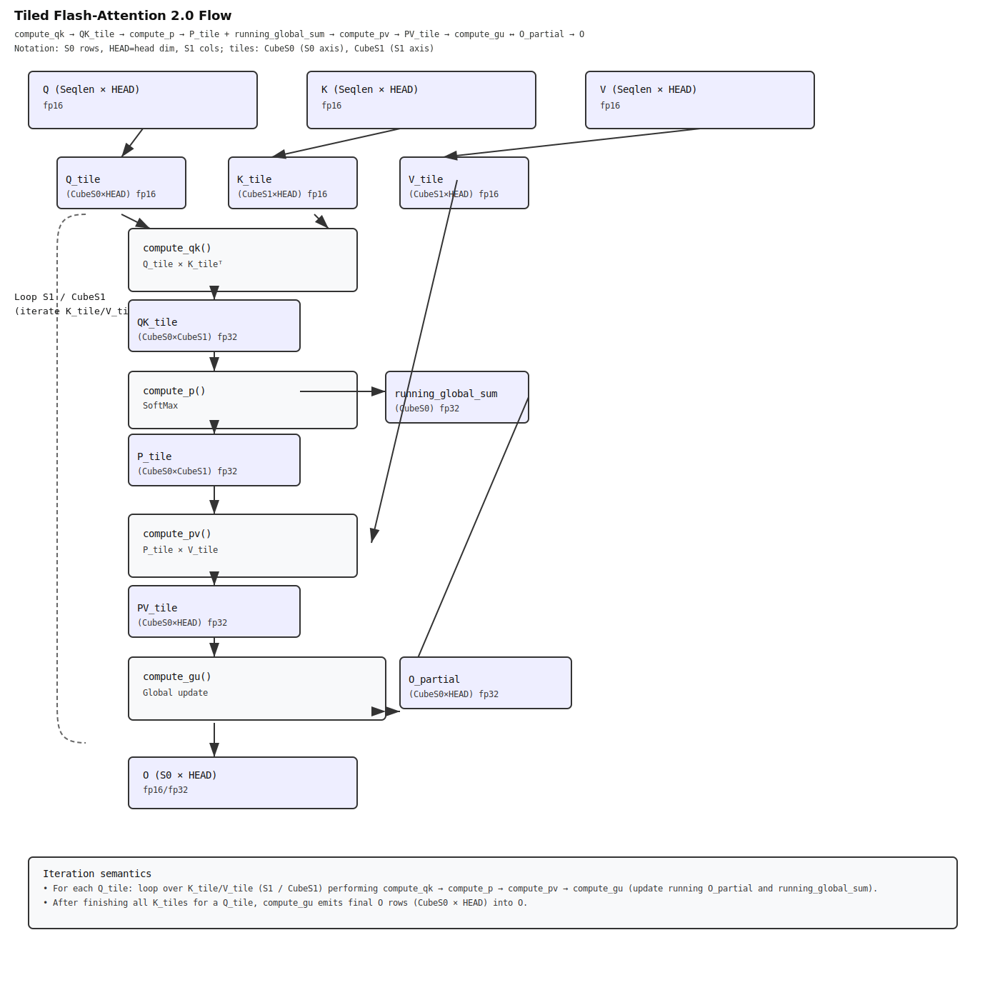
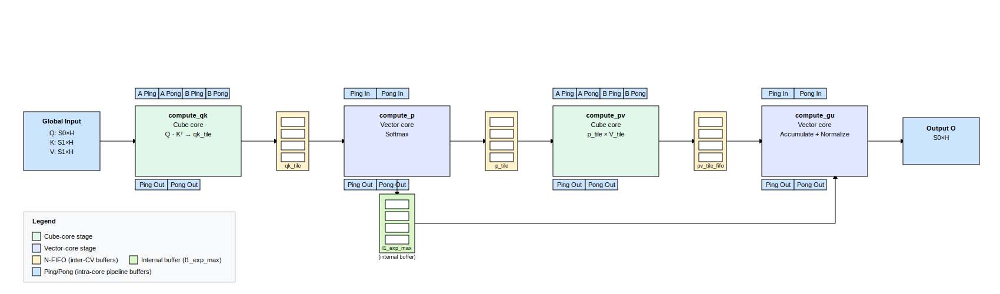
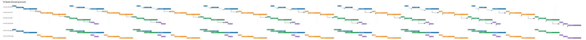
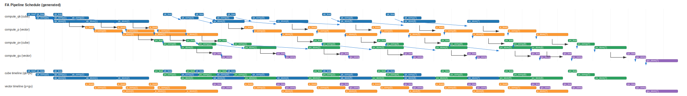
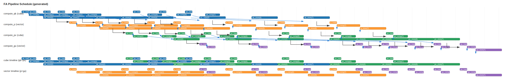
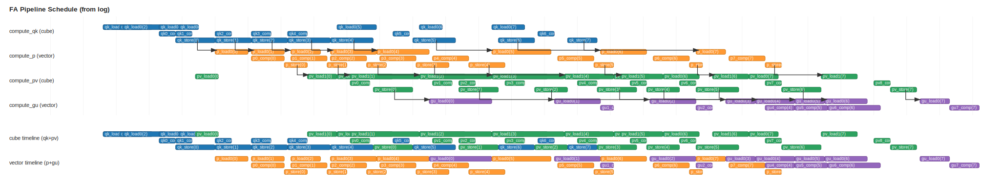

## 概览

本示例演示如何使用 PTO 实现混合精度的 Flash Attention（FA）算子，包含工程结构、构建与运行方式。

## 支持的 AI 处理器

- Ascend A2 (Ascend 910B)
- Ascend A3 (Ascend 910C)

## 目录结构

```
kernels/manual/common/flash_atten/
├── scripts/
│   └── gen_data.py              # 生成输入与 golden 输出
├── CMakeLists.txt               # 构建配置
├── fa_performance_kernel.cpp    # Kernel 实现
├── main.cpp                     # Host 侧入口
└── run.sh                       # 便捷脚本
```

## 构建与运行

1. 配置 Ascend CANN 环境（示例路径）：

```bash
source ${ASCEND_INSTALL_PATH}/bin/setenv.bash
```

2. 运行示例：

```bash
cd ${git_clone_path}/kernels/manual/common/flash_atten

# 运行默认 case（与 generated_cases.* 中内置集合一致）
bash run.sh -r npu -v Ascend910B1

# 从内置集合中只运行一个 case
bash run.sh -r npu -v Ascend910B1 -c case_float_H_128_S0_128_S1_1024

# 提供自定义 case（用分号分隔：HEAD_SIZE,S0,S1,CUBE_S0,TILE_S1）
# TILE_S1：支持 128（=CUBE_S1）、256、512
bash run.sh -r npu -v Ascend910B1 --cases "128,128,1024,128,128;128,2048,2048,128,512"

# 提供自定义 case，并只运行其中一个
bash run.sh -r npu -v Ascend910B1 --cases "128,128,1024,128,128;128,512,2048,128,128" \
  -c case_float_H_128_S0_128_S1_1024

```

成功时输出：

```text
test success
```

## 性能

本节记录该目录下手工 Flash Attention kernel 的参考性能数据。

定义：
- `S0`：query 序列长度（Q/O 的行数）。
- `S1`：key/value 序列长度（K/V 的行数）。
- `Total task time (us)`：每个 task 的端到端 kernel 时间（微秒）。
- `GOps`：该 task 计数的总运算量。
- `TFLOPS`：`GOps / time`。
- `Normalized TFLOPS`：`TFLOPS × (24 / cores_used)`，用于估算在 24 核 A3 上的满芯吞吐。

### 小结

- 更大的 `S1` 能提升利用率；归一化吞吐从 `S1=1024` 到 `S1=4096` 增幅很明显。
- 对 `S1=8192`，1–2 核的最佳归一化吞吐非常接近（≈172.9 vs 171.4），提示该 kernel 正接近带宽/同步上限，而非随核数线性扩展。
- 4/8 核在较小 `S1` 时归一化吞吐更低，通常被固定开销主导（流水线 warm-up、同步、以及内存搬运）。
- 仿真（simulation）数值可能显著高于板上实测，因为模拟器不会建模所有硬件争用/时延特性；性能决策请以板上数据为准。

### 表格（A2/A3）

归一化 TFLOPS（越高越好）：

| Cores | S0 | S1=1024 | S1=2048 | S1=4096 | S1=8192 |
| --- | --- | --- | --- | --- | --- |
| 1 | 128 | 38.27 | 62.62 | 147.08 | 172.86 |
| 2 | 256 | 48.51 | 73.04 | 148.03 | 171.43 |
| 4 | 512 | 38.60 | 58.10 | 138.19 | 149.27 |
| 8 | 1024 | 25.28 | 37.51 | 99.94 | 120.04 |

Total task time（us，越低越好）：

| Cores | S0 | S1=1024 | S1=2048 | S1=4096 | S1=8192 |
| --- | --- | --- | --- | --- | --- |
| 1 | 128 | 42.08 | 51.44 | 43.80 | 74.54 |
| 2 | 256 | 33.201 | 44.101 | 43.521 | 75.162 |
| 4 | 512 | 41.721 | 55.441 | 46.621 | 86.322 |
| 8 | 1024 | 63.72 | 85.882 | 64.461 | 107.342 |

GOps：

| Cores | S0 | S1=1024 | S1=2048 | S1=4096 | S1=8192 |
| --- | --- | --- | --- | --- | --- |
| 1 | 128 | 67.11 | 134.22 | 268.44 | 536.87 |
| 2 | 256 | 134.22 | 268.44 | 536.87 | 1073.74 |
| 4 | 512 | 268.44 | 536.87 | 1073.74 | 2147.48 |
| 8 | 1024 | 536.87 | 1073.74 | 2147.48 | 4294.97 |

实测 TFLOPS：

| Cores | S0 | S1=1024 | S1=2048 | S1=4096 | S1=8192 |
| --- | --- | --- | --- | --- | --- |
| 1 | 128 | 1.59 | 2.61 | 6.13 | 7.20 |
| 2 | 256 | 4.04 | 6.09 | 12.34 | 14.29 |
| 4 | 512 | 6.43 | 9.68 | 23.03 | 24.88 |
| 8 | 1024 | 8.43 | 12.50 | 33.31 | 40.01 |

仿真与板上对比（Seq = 2K）：

| Run | Total task time (us) | Normalized TFLOPS |
| --- | --- | --- |
| 板上（NPU） | 147.92 | 21.78 |
| 仿真（Simulation） | 28.59 | 112.66 |

## 算子说明

本节从“数学公式 → 分块计算 → PTO 实现/调参”的顺序，说明该 Flash Attention kernel。核心代码分为四个阶段：`compute_qk`、`compute_p`、`compute_pv`、`compute_gu`。

### 1. 计算流程（FlashAttention 2.0）

令 Q ∈ ℝ^{S0×H}、K ∈ ℝ^{H×S1}、V ∈ ℝ^{S1×H}，其中 H 为 `HEAD_SIZE`。单头 attention 的标准形式（省略 softmax 常数项）为：

$$\text{QK} = Q K^\top \in \mathbb{R}^{S0\times S1}$$
$$P = \operatorname{softmax}\!\left(\frac{\text{QK}}{\tau}\right)\in \mathbb{R}^{S0\times S1}$$
$$O = P\,V \in \mathbb{R}^{S0\times H}$$

为了降低显存占用并提升访存效率，QK 与 softmax 会按 (S0, S1) 分块（tile）流式计算，并在遍历 S1-tiles 的过程中持续更新输出 O 的“running sum”。

#### 数值稳定的 tiled softmax（按 S1 分块）

对每一行 \(i\)，在处理当前 tile 时会做如下递推（与常见的数值稳定 softmax 写法等价）：

**步骤 1：局部行最大值（local row max）**

$$
m_i = \max_j X_{ij}
$$

`local_max`：当前 tile 每一行的最大值。

**步骤 2：更新全局最大值（updated global max）**

$$
M_i = \max\!\big(M_{\text{prev},i},\; m_i\big)
$$

`new_global_max`：把历史全局 max 与当前 tile 的 local max 合并。

**步骤 3：历史项重标定系数（rescaling factor）**

$$
\\text{exp\\_max}_i = \exp\!\Big(s \cdot (M_{\text{prev},i} - M_i)\Big)
$$

`l1_exp_max`：当 max 增大时，用该指数因子重标定历史累加项。

**步骤 4：逐元素指数（per-element exponentials）**

$$
e_{ij} = \exp\!\Big(s \cdot (X_{ij} - M_i)\Big)
$$

`p_tile_fp32` / `x_exp`：逐元素指数值（`p_tile_fp32` 为 FP32 缓冲；`x_exp` 会 cast 为 fp16 供后续 matmul）。

**步骤 5：本 tile 的局部和（local sum）**

$$
\ell_i = \sum_j e_{ij}
$$

`local_sum`：当前 tile 的逐行指数和。

**步骤 6：更新全局和（updated global sum）**

$$
S_i = \\text{exp\\_max}_i \cdot S_{\text{prev},i} + \ell_i
$$

`l2_global_sum`：数值稳定的递推累加式。

处理完所有 tiles 后，得到最终 softmax 概率：

$$
p_{ij} = \frac{e_{ij}}{S_i}
$$

备注：
- 缩放系数 $s = \frac{1}{\sqrt{\mathbb{HEAD\_SIZE}}}$
- 当全局 max 增大时，通过重标定历史累加项保证数值稳定
- Kernel 会保存 `x_exp` 供 `compute_pv` 使用，同时保留 `l1_exp_max` 与 `l2_global_sum` 供 `compute_gu` 做 running 累加与最终归一化

<div>

</div>

### 2. 张量形状（按阶段）

- 输入：
  - Q：`S0 × HEAD_SIZE`（fp16）
  - K：`S1 × HEAD_SIZE`（fp16）
  - V：`S1 × HEAD_SIZE`（fp16）
- 每个 S1 tile 的中间量（tile t）：
  - `qk_tile`：`S0 × Cube_S1`（fp32 累加），例如 `64×128` / `128×128`
  - `p_tile`（`x_exp`）：`S0 × Cube_S1`（fp16，用于 matmul）
  - `pv_tile`：`S0 × HEAD_SIZE`（fp32），每个 tile 的部分结果
- 输出：
  - O：`S0 × HEAD_SIZE`（fp16/fp32）

### 3. 分阶段实现与调参

#### `compute_qk`（Cube matmul）

- 作用：计算单个 S1 tile 的 Q·K_t（cube pipeline）。
- 实现要点：
  - Q tile 做 leftTile 驻留：当 `tile_idx==0` 时加载一次 Q；后续 tiles 只加载 K，减少从 GM 的重复读取
  - qk 部分结果写入紧凑的 ping/pong 全局缓冲
  - 复用 `matmul_macro_pto`（matTile → accTile），并维护 left/right tiles 的 ping/pong 状态
- 调参点：
  - `assign_running_acc_tile` 让输出 accTile 在 `compute_qk` 与 `compute_pv` 之间双缓冲
  - `qkPreloadNum`（默认 4）同时决定 `qkp_tile_fifo_size = 1 + qkPreloadNum`，用于 cube 生产者与 vector softmax 消费者之间的 FIFO 深度

#### `compute_p`（Vector softmax：`TSOFTMAXFA`）

- 作用：在 S1 维度按 tile 增量计算并保持数值稳定的 tiled softmax。
- 实现要点：
  - Vector tiling：`Vec_S0 = S0 / VEC_CORES`，每个 vector subblock 处理 `Vec_S0 × Cube_S1`；`VEC_CORES` 控制 S0 行在 vector subblock 间的切分
  - 每个 vector core 用 `get_subblockid()` 计算全局张量 load/store 的 tile 索引与 qk/p/pv/o buffer 偏移，自然形成 SPMD 并行
  - `TSOFTMAXFA` 微内核负责 softmax 递推：保存每个 tile 的 `l1_exp_max` 与 `l2_global_sum`，供 `compute_gu` 做 running 累加并在最后一步计算最终 O
- 实现取舍：
  - 优先使用固定 tile 尺寸的 `TROWMAX`/`TROWSUM`（128/256/512/1024 reduce 轴上的实现通常更高效）
  - 对动态有效行/列可先做 `TFILLPAD`（PAD_MIN/-INF）把动态 mask 转成静态（例如处理动态 S0）
  - `TROWEXPANDSUB` 支持原地计算（dst==src），可减少临时 buffer
- UB 分配（`allocate_vec_tile_buffers`）：
  - 目的：为 `compute_p`/`compute_gu` 的 per-vector tiles 预先规划 UB 偏移，让 vector cores 复用一小组固定 UB 地址
  - 常用参数：`SrcBuffers`、`XexpBuffers`、`pvVecBuffers`、`ExpMaxBuffers`（`ExpMaxBuffers` 通常等于 `qkp_tile_fifo_size`）
  - 典型分配顺序：`qk` vec tiles → `m1_local_max` → `m2_global_max` → `input_reduce_tmp` → `l1_local_sum` → `l2_global_sum` → `l1_exp_max[]` → `x_exp[]` → `runningOTile`

#### `compute_pv`（P·V matmul）

- 作用：把每个 tile 的 P（softmax 输出）与对应的 V tile 相乘，得到 PV 的部分累加（cube matmul 风格）。
- 实现要点：
  - 加载 V tile 与 P tile，并把 `pv_tile_fifo` 写入全局 float buffer 的 per-tile ping/pong 缓冲
- 调参点：
  - `pv_tile_fifo_size`（通常为 `1 + qkPreloadNum`）控制 P 生产与 GU 消费之间的 FIFO 深度

#### `compute_gu`（归约 / 归一化）

- 作用：消费 `pv_tile_fifo` 并累加到 `runningOTile`；最后一个 tile 触发对 `l2_global_sum` 的最终除法得到输出 O。
- 实现要点：
  - vector core 驱动，使用 `TGU_ND` / `TGU_LAST_ND` 宏做 per-tile 累加
- 实现取舍：
  - 保持 `runningOTile` 绑定（assigned），避免重复分配
  - `TROWEXPANDMUL`/`TROWEXPANDDIV` 支持原地计算（dst==src），可减少临时 buffer

### 4. 流水线编排（Cube/Vector 并行）

跨阶段通过 CV FIFO + 阶段内 ping/pong 做软件流水化：

<div>

</div>

S1 tiles 循环中的典型流程：

1. cube：`compute_qk` 预加载下一批 QK tile，并通过 flag 通知 vector
2. vector：`compute_p` 等待 qk 就绪，在该 chunk 上运行 `TSOFTMAXFA` 产出 p tile，并通知 pv 消费者
3. cube：`compute_pv` 消费 p 与 v，生成 `pv_tile_fifo`，写回全局并通知 GU 消费者
4. vector：`compute_gu` 消费 `pv_tile_fifo` 并累加到 `runningOTile`

阶段内的关键机制：
- `matmul_macro_pto` + `assign_running_acc_tile`：leftTile/rightTile/AccTile 的双缓冲，使 cube core 能在 preload 序列里交错 `compute_qk` 与 `compute_pv`
- `compute_p` 的 qk 输入与 p 输出也做双缓冲；`expT` 提供多 preload buffer，支持更晚的结果转发

通过阶段重排打破依赖（示例）：

- 以 Head=128、S0=128、S1=1024 为例，CUBE_S1=128 时共有 4 个 loop，每个 loop 执行 `compute_qk -> compute_p -> compute_pv -> compute_gu`。在不做预执行（preload）的情况下，这四段会趋向串行：

<div>

</div>

增大 `qkPreloadNum` 后，可以让 cube pipeline “跑在前面”，更好地把 vector 侧资源摊平（下图为示意）：

<div>

</div>

<div>

</div>

仿真中（H128，Seqlen=1024）的行为与上述趋势一致：

<div>

</div>

从该 case 的流水线图可以看到瓶颈更偏向 cube 侧的 `TSTORE`（Cube 利用率约 30%），后续优化会优先围绕这一点展开。

调参入口（knobs）：
- `qkPreloadNum`：允许 cube pipeline 预先产出更多 QK tiles
- `qkp_tile_fifo_size`：qk/p FIFO 深度（通常为 `1 + qkPreloadNum`）
- `pv_tile_fifo_size`：PV FIFO 深度（通常与 qk FIFO 深度匹配），用于与 GU 重叠
- 同步：优先用轻量 device flags；在 UB 允许时，尽量用更深的 FIFO/更大的 preload 拉开重叠

### 5. 多核切分与负载均衡

- 多核 tiling：
  - QKV 输入是 BNSD（Batch、Head 数、Seqlen、HEAD_SIZE）布局，计算过程中会产生中间的 QK(S0,S1)。由于 S1 是归约轴，多核切分通常按 (B, N, S/Cube-S0) 分；在 Flash-decoding 场景中 (B, N, S/Cube-S0) 较小，未来可以考虑沿 S1 轴切分（TODO），每核保留部分 O，并通过另一个 kernel 做最终 GU
  - 对很大的 S0（超过 A2/A3 的最大物理核数 25）时，中间 FIFO buffer 可能引入浪费与不必要的 L2 回写，可按 core id 做进一步优化（TODO）
- 负载均衡：
  - 引入 causal attention mask 时需要考虑稀疏性（TODO），多核 tiling 也要关注沿 S0 轴的负载不均。当前做法是在大 S0 时采用 block 数 > 物理核数的多 block 启动方式；后续可以探索更多策略
