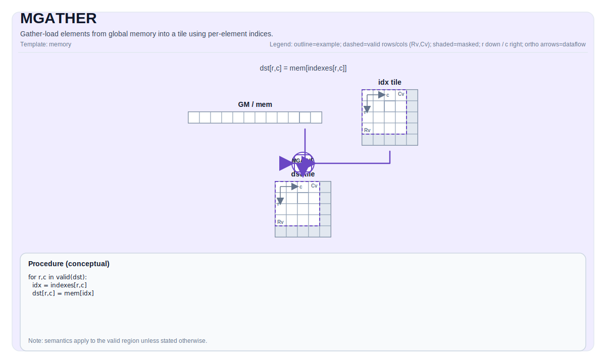

# MGATHER


## Tile Operation Diagram



## Introduction

Gather data from a GlobalTensor (GM) into a Tile using per-row or per-element indices. This custom instruction performs indexed memory access from global memory, supporting both row-level block transfers (e.g., embedding table lookups) and element-level indexed transfers (e.g., sparse access patterns).

MGATHER is implemented as a SIMT kernel using `cce::async_invoke` with 1024 threads (32 warps × 32 lanes).

## Math Interpretation

### Row-Indexed Gather

For a table with `RowWidth`-sized rows, given a 1D index tile `idx` of length `NumRows`:

$$ \mathrm{dst}_{i,j} = \mathrm{table}_{\mathrm{idx}_{i},\, j} \quad \text{for } 0 \le i < \text{NumRows},\; 0 \le j < \text{RowWidth} $$

Each index selects an entire row from the source table.

### Element-Indexed Gather

For per-element indexing where each destination element has its own index:

$$ \mathrm{dst}_{i,j} = \mathrm{table}[\mathrm{idx}_{i,j}] $$

Indices are interpreted as linear element offsets into the source.

## Assembly Syntax

PTO-AS form: see [PTO-AS Specification](../../../../../../../docs/assembly/PTO-AS.md).

Row-indexed gather:

```text
%dst = mgather.row %table, %idx : (!pto.memref<...>, !pto.tile<Nx1xi32>) -> !pto.tile<NxMxT>
```

Element-indexed gather:

```text
%dst = mgather.elem %table, %idx : (!pto.memref<...>, !pto.tile<NxMxi32>) -> !pto.tile<NxMxT>
```

## C++ Intrinsic

Declared in `include/pto/common/pto_instr.hpp` and `include/pto/npu/a5/MGather.hpp`:

```cpp
// Default mode (GatherOOB::Undefined)
template <typename TileDst, typename GlobalData, typename TileInd, typename... WaitEvents>
PTO_INST RecordEvent MGATHER(TileDst& dst, GlobalData& src, TileInd& indexes, WaitEvents&... events);

// Explicit OOB mode
template <GatherOOB Mode, typename TileDst, typename GlobalData, typename TileInd, typename... WaitEvents>
PTO_INST RecordEvent MGATHER(TileDst& dst, GlobalData& src, TileInd& indexes, WaitEvents&... events);
```

**Parameters:**
- `dst`: Destination tile in UB with shape `[NumRows, NumCols]`
- `table`: Source GlobalTensor in GM representing the lookup table
- `indices`: Index tile containing row indices (shape `[NumRows, 1]`) or element indices (shape `[NumRows, NumCols]`)
- `Mode`: Out-of-bounds handling mode (template parameter)

## Out-of-Bounds Handling

The `GatherOOB` enum controls behavior when indices exceed table bounds:

```cpp
enum class GatherOOB : uint8_t {
    Undefined = 0,  // No bounds check
    Clamp     = 1,  // Clamp index to [0, tableSize-1]
    Wrap      = 2,  // Index modulo tableSize (idx % tableSize)
    Zero      = 3   // Return zero for out-of-bounds accesses
};
```

## Constraints

### Data Types (A5)

- `TileDst::DType` must be one of: `int8_t`, `uint8_t`, `int16_t`, `uint16_t`, `int32_t`, `uint32_t`, `half`, `bfloat16_t`, `float`, `float8_e4m3_t`, `float8_e5m2_t`.

### Index Types

- `TileIdx::DType` must be `int32_t` or `uint32_t`.

### Tile Constraints

- Destination tile location must be `TileType::Vec` (UB).
- Index tile location must be `TileType::Vec` (UB).
- `TileDst::Rows == TileIdx::Rows` (matching row count).
- `TileIdx::Cols == 1` for row-indexed gather, or `TileIdx::Cols == TileDst::Cols` for element-indexed gather.
- Destination and table must have the same data type.

### Shape Constraints

- For row-indexed mode: Table shape dimension 3 specifies number of rows, dimension 4 specifies row width.
- For element-indexed mode: Table is treated as a linear array of size `Shape[3] * Shape[4]`.

## Examples

### Row-Indexed Gather (Embedding Lookup)

```cpp
#include <pto/npu/a5/custom/MGather.hpp>

using namespace pto;

template <typename T, int NumRows, int RowWidth, int TableRows>
void example_embedding_lookup(__gm__ T* table, __gm__ int32_t* indices) {
    using IdxTile = Tile<TileType::Vec, int32_t, NumRows, 1>;
    using DstTile = Tile<TileType::Vec, T, NumRows, RowWidth>;
    using TableShape = Shape<1, 1, 1, TableRows, RowWidth>;
    using TableStride = Stride<1, 1, 1, RowWidth, 1>;
    using TableTensor = GlobalTensor<T, TableShape, TableStride, Layout::ND>;
    
    TableTensor tableGM(table);
    IdxTile idx;
    DstTile dst;
    
    TASSIGN(idx, 0x0);
    TASSIGN(dst, 0x1000);
    
    // Load indices from global memory
    GlobalTensor<int32_t, Shape<1,1,1,1,NumRows>, Stride<1,1,1,1,1>> idxGlobal(indices);
    TLOAD(idx, idxGlobal);
    
    // Perform gather with wrap mode for hash tables
    MGATHER<GatherOOB::Wrap>(dst, tableGM, idx);
}
```

### Element-Indexed Gather (Sparse Access)

```cpp
#include <pto/npu/a5/custom/MGather.hpp>

using namespace pto;

void example_sparse_gather(__gm__ float* data, __gm__ int32_t* sparseIndices) {
    using IdxTile = Tile<TileType::Vec, int32_t, 16, 16>;
    using DstTile = Tile<TileType::Vec, float, 16, 16>;
    using DataShape = Shape<1, 1, 1, 1024, 64>;
    using DataStride = Stride<1, 1, 1, 64, 1>;
    using DataTensor = GlobalTensor<float, DataShape, DataStride, Layout::ND>;
    
    DataTensor dataGM(data);
    IdxTile idx;
    DstTile dst;
    
    TASSIGN(idx, 0x0);
    TASSIGN(dst, 0x2000);
    
    // Gather with zero-fill for OOB indices
    MGATHER<GatherOOB::Zero>(dst, dataGM, idx);
}
```

### Manual Memory Assignment

```cpp
#include <pto/npu/a5/custom/MGather.hpp>

using namespace pto;

void example_manual() {
    using IdxTile = Tile<TileType::Vec, int32_t, 8, 1>;
    using DstTile = Tile<TileType::Vec, half, 8, 64>;
    using TableShape = Shape<1, 1, 1, 65536, 64>;
    using TableStride = Stride<1, 1, 1, 64, 1>;
    using TableTensor = GlobalTensor<half, TableShape, TableStride, Layout::ND>;
    
    __gm__ half* tablePtr = /* ... */;
    TableTensor tableGM(tablePtr);
    
    IdxTile idx;
    DstTile dst;
    
    TASSIGN(idx, 0x0);
    TASSIGN(dst, 0x1000);
    
    MGATHER<GatherOOB::Clamp>(dst, tableGM, idx);
}
```

## Performance Considerations

1. **Row-indexed gather** is more efficient than element-indexed when accessing structured data (embeddings, weight matrices) because it enables coalesced memory access within each row.

2. **Index locality**: When possible, sort indices to improve cache hit rates.

3. **SIMT execution**: The kernel uses 1024 threads (32 warps × 32 lanes) for parallel gather operations.

4. **Out-of-bounds mode**: `GatherOOB::Undefined` is fastest but requires indices to be valid. Use `Clamp`, `Wrap`, or `Zero` when indices may exceed bounds.

## Related Instructions

- [`TLOAD`](../../../../../../../docs/isa/TLOAD.md): Contiguous block transfer from GM to Tile
- [`TGATHER`](../../../../../../../docs/isa/TGATHER.md): Index-based gather within tiles (UB-to-UB)
- [`MSCATTER`](../mscatter/MSCATTER.md): Indexed scatter from Tile to GM (inverse operation)

## Test Cases

| Case | Data Type | Table Size | Output Size | Mode | Description |
|------|-----------|------------|-------------|------|-------------|
| case_half_16x64_8x32 | half | 16×64 | 8×32 | Undefined | Default mode |
| case_half_16x128_8x64 | half | 16×128 | 8×64 | Undefined | Default mode |
| case_half_32x128_16x64 | half | 32×128 | 16×64 | Undefined | Default mode |
| case_half_16x256_8x128 | half | 16×256 | 8×128 | Undefined | Default mode |
| case_half_64x64_32x32 | half | 64×64 | 32×32 | Undefined | Default mode |
| case_float_8x64_4x32 | float | 8×64 | 4×32 | Undefined | Default mode |
| case_float_16x64_8x32 | float | 16×64 | 8×32 | Undefined | Default mode |
| case_float_32x64_16x32 | float | 32×64 | 16×32 | Undefined | Default mode |
| case_float_16x16_8x8 | float | 16×16 | 8×8 | Undefined | Default mode |
| case_int32_8x32_4x16 | int32 | 8×32 | 4×16 | Undefined | Default mode |
| case_int32_16x64_8x32 | int32 | 16×64 | 8×32 | Undefined | Default mode |
| case_int32_32x32_16x16 | int32 | 32×32 | 16×16 | Undefined | Default mode |
| case_uint8_16x64_8x32 | uint8 | 16×64 | 8×32 | Undefined | Default mode |
| case_uint8_32x64_16x32 | uint8 | 32×64 | 16×32 | Undefined | Default mode |
| case_float_clamp_16x64_8x32 | float | 16×64 | 8×32 | Clamp | OOB indices clamped to table bounds |
| case_int32_wrap_16x64_8x32 | int32 | 16×64 | 8×32 | Wrap | OOB indices wrapped via modulo |
| case_half_zero_16x64_8x32 | half | 16×64 | 8×32 | Zero | OOB indices return zero |
