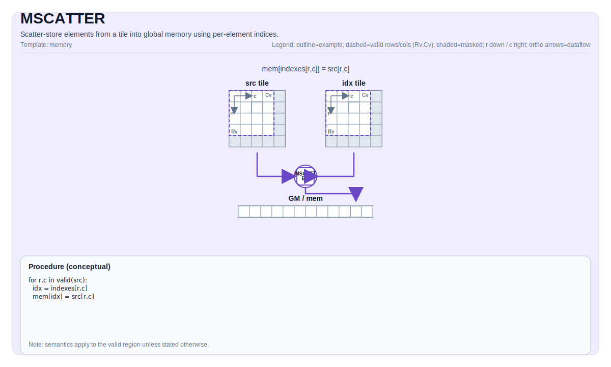

# MSCATTER


## Tile Operation Diagram



## Introduction

Scatter data from a Tile into a GlobalTensor (GM) using per-row or per-element indices. This custom instruction performs indexed memory writes to global memory, supporting both row-level block transfers (e.g., expert weight updates) and element-level indexed transfers (e.g., sparse gradient accumulation).

MSCATTER is implemented as a SIMT kernel using `cce::async_invoke` with 1024 threads (32 warps × 32 lanes). Optional atomic operations handle write conflicts when multiple source elements target the same destination.

## Math Interpretation

### Row-Indexed Scatter

For a table with `RowWidth`-sized rows, given a 1D index tile `idx` of length `NumRows`:

$$ \mathrm{table}_{\mathrm{idx}_{i},\, j} = \mathrm{src}_{i,j} \quad \text{for } 0 \le i < \text{NumRows},\; 0 \le j < \text{RowWidth} $$

Each index specifies the destination row in the table where the corresponding source row is written.

### Element-Indexed Scatter

For per-element indexing where each source element specifies its destination:

$$ \mathrm{table}[\mathrm{idx}_{i,j}] = \mathrm{src}_{i,j} $$

Indices are interpreted as linear element offsets into the destination.

### Atomic Accumulation Mode

When `ScatterAtomicOp::Add` is specified:

$$ \mathrm{table}[\mathrm{idx}_{i,j}] \mathrel{+}= \mathrm{src}_{i,j} $$

## Assembly Syntax

PTO-AS form: see [PTO-AS Specification](../../../../../../../docs/assembly/PTO-AS.md).

Row-indexed scatter:

```text
mscatter.row %table, %src, %idx : (!pto.memref<...>, !pto.tile<NxMxT>, !pto.tile<Nx1xi32>)
```

Element-indexed scatter:

```text
mscatter.elem %table, %src, %idx : (!pto.memref<...>, !pto.tile<NxMxT>, !pto.tile<NxMxi32>)
```

Atomic scatter:

```text
mscatter.row.atomic_add %table, %src, %idx : (!pto.memref<...>, !pto.tile<NxMxT>, !pto.tile<Nx1xi32>)
```

## C++ Intrinsic

Declared in `include/pto/common/pto_instr.hpp` and `include/pto/npu/a5/MScatter.hpp`:

```cpp
// Default mode (ScatterAtomicOp::None, ScatterOOB::Undefined)
template <typename GlobalData, typename TileSrc, typename TileInd, typename... WaitEvents>
PTO_INST RecordEvent MSCATTER(GlobalData& dst, TileSrc& src, TileInd& indexes, WaitEvents&... events);

// Explicit atomic mode
template <ScatterAtomicOp Atomic, typename GlobalData, typename TileSrc, typename TileInd, typename... WaitEvents>
PTO_INST RecordEvent MSCATTER(GlobalData& dst, TileSrc& src, TileInd& indexes, WaitEvents&... events);

// Explicit atomic + OOB mode
template <ScatterAtomicOp Atomic, ScatterOOB Mode, typename GlobalData, typename TileSrc, typename TileInd,
          typename... WaitEvents>
PTO_INST RecordEvent MSCATTER(GlobalData& dst, TileSrc& src, TileInd& indexes, WaitEvents&... events);
```

**Parameters:**
- `table`: Destination GlobalTensor in GM
- `src`: Source tile in UB with shape `[NumRows, NumCols]`
- `indices`: Index tile containing row indices (shape `[NumRows, 1]`) or element indices (shape `[NumRows, NumCols]`)
- `Atomic`: Atomic operation mode for handling write conflicts (template parameter)
- `Mode`: Out-of-bounds handling mode (template parameter)

## Atomic Types

The `ScatterAtomicOp` enum controls behavior when multiple source elements write to the same destination:

```cpp
enum class ScatterAtomicOp : uint8_t {
    None = 0,  // Non-atomic write
    Add  = 1,  // Atomic addition
    Max  = 2,  // Atomic maximum
    Min  = 3   // Atomic minimum
};
```

### Atomic Type Constraints

- `AtomicNone`: Available for all supported data types
- `AtomicAdd`: Available for `int32_t`, `uint32_t`, `float`, `half`
- `AtomicMax`: Available for `int32_t`, `float`
- `AtomicMin`: Available for `int32_t`, `float`

## Out-of-Bounds Handling

The `ScatterOOB` enum controls behavior when indices exceed table bounds:

```cpp
enum class ScatterOOB : uint8_t {
    Undefined = 0,  // No bounds check
    Skip      = 1,  // Skip OOB writes (no memory access)
    Clamp     = 2,  // Clamp index to valid range [0, tableSize-1]
    Wrap      = 3   // Index modulo tableSize (idx % tableSize)
};
```

## Constraints

### Data Types (A5)

- `TileSrc::DType` must be one of: `int8_t`, `uint8_t`, `int16_t`, `uint16_t`, `int32_t`, `uint32_t`, `half`, `bfloat16_t`, `float`, `float8_e4m3_t`, `float8_e5m2_t`.

### Index Types

- `TileIdx::DType` must be `int32_t` or `uint32_t`.

### Tile Constraints

- Source tile location must be `TileType::Vec` (UB).
- Index tile location must be `TileType::Vec` (UB).
- `TileSrc::Rows == TileIdx::Rows` (matching row count).
- `TileIdx::Cols == 1` for row-indexed scatter, or `TileIdx::Cols == TileSrc::Cols` for element-indexed scatter.
- Source and table must have the same data type.

### Shape Constraints

- For row-indexed mode: Table shape dimension 3 specifies number of rows, dimension 4 specifies row width.
- For element-indexed mode: Table is treated as a linear array of size `Shape[3] * Shape[4]`.

## Examples

### Row-Indexed Scatter (Weight Update)

```cpp
#include <pto/npu/a5/custom/MScatter.hpp>

using namespace pto;

template <typename T, int NumRows, int RowWidth, int TableRows>
void example_weight_update(__gm__ T* table, __gm__ int32_t* indices) {
    using IdxTile = Tile<TileType::Vec, int32_t, NumRows, 1>;
    using SrcTile = Tile<TileType::Vec, T, NumRows, RowWidth>;
    using TableShape = Shape<1, 1, 1, TableRows, RowWidth>;
    using TableStride = Stride<1, 1, 1, RowWidth, 1>;
    using TableTensor = GlobalTensor<T, TableShape, TableStride, Layout::ND>;
    
    TableTensor tableGM(table);
    IdxTile idx;
    SrcTile src;
    
    TASSIGN(idx, 0x0);
    TASSIGN(src, 0x1000);
    
    // Scatter with skip mode for invalid indices
    MSCATTER<ScatterAtomicOp::None, ScatterOOB::Skip>(tableGM, src, idx);
}
```

### Atomic Gradient Accumulation

```cpp
#include <pto/npu/a5/custom/MScatter.hpp>

using namespace pto;

void example_gradient_accumulation(__gm__ float* gradTable, __gm__ int32_t* tokenIndices) {
    using IdxTile = Tile<TileType::Vec, int32_t, 16, 1>;
    using GradTile = Tile<TileType::Vec, float, 16, 64>;
    using TableShape = Shape<1, 1, 1, 65536, 64>;
    using TableStride = Stride<1, 1, 1, 64, 1>;
    using TableTensor = GlobalTensor<float, TableShape, TableStride, Layout::ND>;
    
    TableTensor tableGM(gradTable);
    IdxTile idx;
    GradTile grads;
    
    TASSIGN(idx, 0x0);
    TASSIGN(grads, 0x1000);
    
    // Atomic add for gradient accumulation
    MSCATTER<ScatterAtomicOp::Add, ScatterOOB::Skip>(tableGM, grads, idx);
}
```

### Element-Indexed Scatter (Sparse Update)

```cpp
#include <pto/npu/a5/custom/MScatter.hpp>

using namespace pto;

void example_sparse_update(__gm__ float* data, __gm__ int32_t* sparseIndices) {
    using IdxTile = Tile<TileType::Vec, int32_t, 16, 16>;
    using SrcTile = Tile<TileType::Vec, float, 16, 16>;
    using DataShape = Shape<1, 1, 1, 1024, 64>;
    using DataStride = Stride<1, 1, 1, 64, 1>;
    using DataTensor = GlobalTensor<float, DataShape, DataStride, Layout::ND>;
    
    DataTensor dataGM(data);
    IdxTile idx;
    SrcTile src;
    
    TASSIGN(idx, 0x0);
    TASSIGN(src, 0x2000);
    
    // Scatter with wrap mode
    MSCATTER<ScatterAtomicOp::None, ScatterOOB::Wrap>(dataGM, src, idx);
}
```

### Manual Memory Assignment

```cpp
#include <pto/npu/a5/custom/MScatter.hpp>

using namespace pto;

void example_manual() {
    using IdxTile = Tile<TileType::Vec, int32_t, 8, 1>;
    using SrcTile = Tile<TileType::Vec, half, 8, 64>;
    using TableShape = Shape<1, 1, 1, 65536, 64>;
    using TableStride = Stride<1, 1, 1, 64, 1>;
    using TableTensor = GlobalTensor<half, TableShape, TableStride, Layout::ND>;
    
    __gm__ half* tablePtr = /* ... */;
    TableTensor tableGM(tablePtr);
    
    IdxTile idx;
    SrcTile src;
    
    TASSIGN(idx, 0x0);
    TASSIGN(src, 0x1000);
    
    MSCATTER<ScatterAtomicOp::None, ScatterOOB::Clamp>(tableGM, src, idx);
}
```

## Performance Considerations

1. **Row-indexed scatter** is more efficient than element-indexed when writing structured data because it enables coalesced memory access within each row.

2. **Atomic operations**: Use `ScatterAtomicOp::None` when indices are guaranteed unique for best performance. Atomic modes add synchronization overhead.

3. **SIMT execution**: The kernel uses 1024 threads (32 warps × 32 lanes) for parallel scatter operations.

4. **Out-of-bounds mode**: `ScatterOOB::Undefined` is fastest but requires indices to be valid. Use `Skip`, `Clamp`, or `Wrap` when indices may exceed bounds.

5. **Write conflicts**: When multiple source elements target the same destination with `AtomicNone`, the result is non-deterministic (last writer wins).

## Related Instructions

- [`TSTORE`](../../../../../../../docs/isa/TSTORE.md): Contiguous block transfer from Tile to GM
- [`TSCATTER`](../../../../../../../docs/isa/TSCATTER.md): Index-based scatter within tiles (UB-to-UB)
- [`MGATHER`](../mgather/MGATHER.md): Indexed gather from GM to Tile (inverse operation)

## Test Cases

| Case | Data Type | Src Size | Out Size | Atomic | OOB Mode | Description |
|------|-----------|----------|----------|--------|----------|-------------|
| case_half_8x32_1024 | half | 8×32 | 1024 | None | Undefined | Default mode |
| case_half_16x64_2048 | half | 16×64 | 2048 | None | Undefined | Default mode |
| case_float_8x32_512 | float | 8×32 | 512 | None | Undefined | Default mode |
| case_float_16x32_1024 | float | 16×32 | 1024 | None | Undefined | Default mode |
| case_float_16x64_2048 | float | 16×64 | 2048 | None | Undefined | Default mode |
| case_float_8x8_128 | float | 8×8 | 128 | None | Undefined | Default mode |
| case_int32_8x16_256 | int32 | 8×16 | 256 | None | Undefined | Default mode |
| case_int32_16x32_1024 | int32 | 16×32 | 1024 | None | Undefined | Default mode |
| case_int32_16x16_512 | int32 | 16×16 | 512 | None | Undefined | Default mode |
| case_uint8_16x32_1024 | uint8 | 16×32 | 1024 | None | Undefined | Default mode |
| case_uint8_16x64_2048 | uint8 | 16×64 | 2048 | None | Undefined | Default mode |
| case_float_skip_8x32_512 | float | 8×32 | 512 | None | Skip | OOB writes skipped |
| case_int32_clamp_8x16_256 | int32 | 8×16 | 256 | None | Clamp | OOB indices clamped |
| case_half_wrap_8x32_1024 | half | 8×32 | 1024 | None | Wrap | OOB indices wrapped via modulo |
| case_float_atomicadd_8x32_512 | float | 8×32 | 512 | Add | Undefined | Atomic addition |
| case_int32_atomicadd_skip_8x16_256 | int32 | 8×16 | 256 | Add | Skip | Atomic add with OOB skip |
